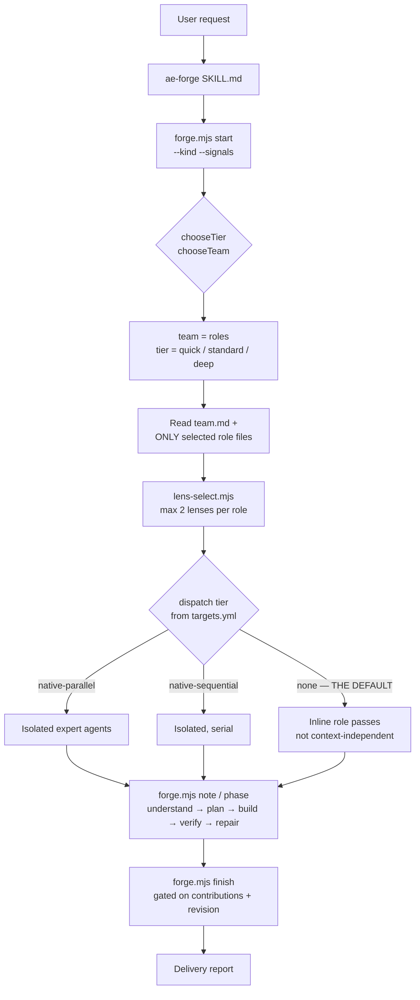
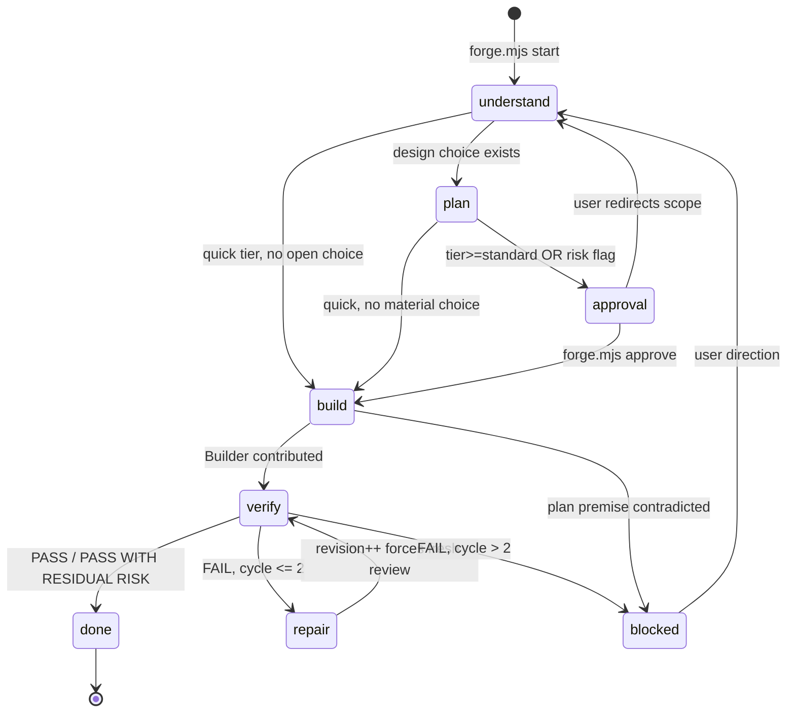

# Development Kit Architecture Review

**Repository:** `agent-engineering` v1.1.2 (commit `4015f90`)
**Reviewed:** 2026-09-20
**Scope:** the operating model — skill architecture, routing, context, lifecycle, gates, portability, cost.
**Comparison inputs:** `C:\Users\anmol\.gemini\config\skills` (9 personal workflows + 72 installed `agency-*` skills), `github.com/msitarzewski/agency-agents`.

---

## 1. Executive Summary

**The architecture is already right. It does not need to be replaced.**

That is the central finding, and it is not a courtesy. The kit has independently arrived at the four decisions that matter most for this problem: one user-facing surface; capability roles with *exclusive* ownership rather than personas; a deterministic state machine that gates completion by exit code rather than by prompt instruction; and a hard rule that everything a skill needs at runtime ships inside the skill directory. Those four decisions are what separate this kit from both comparison systems, and each one is load-bearing.

What the kit has is a well-built **execution engine** with a **missing memory layer** and a **router that fails open**.

Four concrete problems, all measured rather than inferred:

1. **The test suite is red on `main`** (`npm test` → exit 1, 6 failures). The failures are structural, not flaky: `scripts/test-scaffold.sh` invokes `skills/ae-surveyor/scripts/knowledge.mjs`, which does not exist. Stage 3 was converted from a script into a model pass and the tests still encode the deleted design. A kit whose thesis is "independent verification before completion" currently cannot verify itself.

2. **The risk router silently misses.** Measured: `--signals oauth,login`, `sso,saml`, `credentials`, `multi-tenant`, and `rbac` all produce `tier=standard` with **no Security expert**. Only the literal token `auth` triggers it. The same holds for Experience (`frontend`, `react`, `screen`, `form`, `button` all miss; only `ui` hits) and Data (`sql`, `postgres`, `table`, `index` all miss; only `schema`/`migration` hit). The user's own headline example — "Add OAuth login" — routes without a security review unless the model spontaneously types the right word.

3. **There is no durable plan artifact.** `run.json` stores one-line summaries (measured: `"Use passport strategy; 3 files"`). The architecture, the acceptance criteria, and the specialist constraints live only in the conversation. This makes the README's resumability claim stronger than the mechanism supports, and it means the reviewable pre-implementation artifact — the stated central product requirement — does not exist.

4. **Forge never uses the repository map the kit already ships.** `analyze.mjs` is a 652-line token-budgeted repository sensor (`--budget-tokens`, ranked high-signal selection). `ae-forge` references it zero times. On an un-surveyed repository — the default, since the survey is optional — every dispatched expert explores the repository independently and unbudgeted. This is precisely the "ten agents each read the whole repo" cost failure the kit set out to avoid, and it is live today.

The recommended direction is an **evolution of roughly six changes**, not a redesign: fix the suite, make the router fail safe, add a three-file feature directory, wire the repo map into Forge, print the routing decision, and add verified dispatch rows. Everything else — the nine roles, the phase machine, revision-pinned verification, `targets.yml`, the two-skill surface — should be left alone.

The single most instructive artifact in this review is not in this repository. It is in the Gemini workflows, and it is covered in §5.

---

## 2. Current Architecture

### 2.1 Structure

52 files, ~5,500 lines, two public skills.

```
agent-engineering/
├── skills/
│   ├── ae-forge/                        ← the delivery surface
│   │   ├── SKILL.md                185  routing + operating loop + autonomy rules
│   │   ├── references/
│   │   │   ├── team.md              90  result contract, ownership, order, lens algorithm
│   │   │   ├── team.json           159  roles, tiers, signals, lenses, lenses_backlog
│   │   │   ├── roles/*.md        9×~55  exclusive-ownership workflows
│   │   │   └── lenses/            2+26  built: android, ui-finish; 26 backlog
│   │   └── scripts/
│   │       ├── forge.mjs           380  recovery ledger + team selection + phase machine
│   │       └── lens-select.mjs      72  deterministic lens attachment
│   └── ae-surveyor/                     ← optional durable project knowledge
│       ├── SKILL.md                172  six stages
│       ├── references/
│       │   ├── stages/{knowledge,rules}.md
│       │   └── targets.yml         104  the ONLY tool-specific file
│       └── scripts/
│           ├── analyze.mjs         652  deterministic sensor dump, token-budgeted
│           ├── sense.mjs           163  stack/command/component detection
│           ├── rules.mjs           224  gate detection → .dev/rules/
│           ├── scaffold.sh         159  .dev/ dirs, pointers, ignores
│           ├── doctor.sh           203  structural health check
│           └── artifact-support.mjs 85  ← declared in prose, wired to nothing
├── scripts/                             repo-level validation + acceptance tests
├── .claude-plugin/ .codex-plugin/       package manifests
└── docs/DESIGN.md                       product boundary + deliberate exclusions
```

### 2.2 Execution flow



### 2.3 State model

| Store | Committed | Contents |
|---|---|---|
| `.dev/work/<id>/run.json` | no (ignored) | team, tier, phase, revision, approval, one-line contribution summaries |
| `.dev/knowledge/*.md` | yes | five surveyed documents, only if `ae-surveyor` ran |
| `.dev/rules/` | yes | detected enforceable gates |
| `.dev/context/analysis.json` | no | deterministic sensor dump |
| **the conversation** | — | **the plan, acceptance criteria, specialist constraints, findings** |

That last row is the architectural gap. Everything a later session would need in order to continue lives in the one place that does not survive.

### 2.4 What `forge.mjs` actually enforces

The kit's most underrated component. These are exit-code gates, not prompt suggestions:

- every selected pre-build expert must contribute before `phase --to build`
- `approval_required` blocks build until `approve` is recorded
- Builder must contribute before `verify`
- **Verifier's review is pinned to `revision`** — a repair increments the counter, so a stale PASS cannot close a repaired candidate
- named specialists must re-inspect the *current* candidate revision before `finish`
- `kind: audit` can never enter `build`
- phase transitions validate against an explicit table

Verified: 34/34 `test-forge.mjs` assertions pass, including `"a repaired candidate cannot finish on a stale verifier review"`.

---

## 3. Strengths

These should survive any redesign.

**1. Exclusive ownership with explicit negative space.** Every role file states what it does *not* own. `team.md`: *"If a question crosses a border, split it into two explicit decisions. Do not let both roles issue competing answers to the same question."* This is the best single idea in the repository. It prevents the characteristic multi-agent failure where three specialists return three overlapping opinions and the coordinator arbitrates on taste.

**2. Revision-pinned verification.** `forge.mjs` increments `revision` on build/repair and requires a Verifier review at the *current* revision before `finish`. This mechanically prevents the most common agentic lie — "fixed and verified," where the verification predates the fix. Neither comparison system has anything equivalent.

**3. Deterministic/judgment separation.** `ae-surveyor` stage 2 is a parser that *"reports what a parser observed, never what it concluded."* Stage 3 is a model pass. The boundary is stated and correct.

**4. `targets.yml` as the sole tool-specific file** — with provenance, citations, and verification dates. *"Adding support for a tool is a block here, never a code change."* This is the complete answer to IDE portability, and it already exists.

**5. Token-budgeted repository mapping.** `analyze.mjs --budget-tokens 120000 --depth ranked|full`, with ranked high-signal selection and an explicit refusal to *"silently blow past a budget the operator set."* Real cost machinery — currently underused (§4, P4).

**6. Epistemic tagging.** `OBSERVED` / `INFERRED` / `UNKNOWN`, plus: *"There is no fourth tag. `ASSUMED` does not exist in this kit."* This is how you stop a model laundering a guess into a fact.

**7. `LENS UNAVAILABLE`.** When a domain signal fires and no lens exists, the role records the gap instead of improvising: *"Never improvise the missing domain depth from general knowledge presented as if it were checked."* A genuinely novel anti-fabrication mechanism.

**8. Honest capability disclosure.** On `dispatch: none`, Forge *"discloses that the final review was not context-independent."* `AGENTS.md`: *"Never claim a trust boundary the kit does not actually possess."*

**9. Bounded loops.** Two repair cycles, three reproduction attempts, five-finding caps, five-role team maximum.

**10. The simplicity test is written down.** `AGENTS.md`: *"Do not add a stage, role, schema, artifact, command, or policy field unless it changes a user-visible outcome, prevents a demonstrated failure, or materially improves recovery."* This review applies that test to its own recommendations.

---

## 4. Problems and Risks

Only problems with repository evidence. Theoretical concerns are excluded.

### P1 — The test suite is red, and it asserts an architecture that was deleted

```text
Problem:      npm test exits 1. Six assertions fail. They invoke a script
              that does not exist and assert filenames the design abandoned.

Why it matters: The kit's entire value proposition is "planning is not delivery;
              independent verification gates completion." Its own gate is red.
              AGENTS.md lists `npm test` as the command. A permanently-red
              baseline means no future change can be verified by it — the next
              real regression is camouflaged by the six known failures.

Evidence:     `npm test` → exit 1, "6 failed, 57 passed".
              scripts/test-scaffold.sh:165,197,203 call
                node "$SKILL/scripts/knowledge.mjs"
              ls skills/ae-surveyor/scripts/ → analyze.mjs, artifact-support.mjs,
                doctor.sh, lib.sh, rules.mjs, scaffold.sh, sense.mjs.
                knowledge.mjs is absent.
              test-scaffold.sh:199 asserts .dev/knowledge/40-risks.md; the
                current design (SKILL.md stage 3) produces stack/architecture/
                schema/commands/decisions.md — no numbered files.
              doctor.sh:79 warns on "unanswered judgment slots", a concept from
                the template-and-fill design that the model pass replaced.

Impact:       HIGH — maintainability and credibility.

Recommended:  Decide stage 3's contract first, then align the tests to it.
              If stage 3 stays a model pass, the tests must assert what a
              script can assert: the five files exist, carry generated-block
              markers, and every path:line citation resolves. Delete the
              knowledge.mjs invocations and the 40-risks.md assertion.
              Nothing else in P2–P10 is safely verifiable until this is green.
```

### P2 — The risk router fails open on near-synonyms

```text
Problem:      team.json.signals is an exact-match keyword list of ~6 tokens per
              category, matched against a free-text list the model composes.
              Near-synonyms produce no specialist and no warning.

Why it matters: This is worse than having no router. It *looks* deterministic —
              a JSON table named "signals" under a risk-tiering function — so
              both a reader and the model treat it as a safety net. It is a
              six-word thesaurus. Absence of a keyword is silently interpreted
              as absence of risk.

Evidence:     Measured against skills/ae-forge/scripts/forge.mjs:
                --signals oauth,login   → tier=standard  team=architect,builder,verifier
                --signals sso,saml      → tier=standard  (no security)
                --signals credentials   → tier=standard  (no security)
                --signals multi-tenant  → tier=standard  (no security)
                --signals rbac          → tier=standard  (no security)
                --signals auth          → tier=deep      team=…,security,…
              Experience: frontend/react/screen/form/button → miss; only `ui` hits.
              Data:       sql/postgres/table/index → miss; only schema/migration hit.
              The sole real backstop is `--kind security`, which does force
              deep+Security — but the model must already have classified it as
              a security task to pass that kind.

Impact:       HIGH. The product vision's own example ("Add OAuth login") is a
              measured miss.

Recommended:  Stop using vocabulary as the risk detector. Have the model answer
              a short fixed behavioral probe and pass booleans (§9). Keep
              keywords only as additive escalation: a keyword may ADD a role,
              never withhold one. State explicitly in SKILL.md that an empty
              risk set is not evidence of safety.
```

### P3 — No durable plan artifact; resumability is weaker than claimed

```text
Problem:      The only persisted per-task state is run.json, which holds
              one-line summaries. The plan, acceptance criteria, specialist
              constraints and findings exist only in the conversation.

Why it matters: Two separate failures.
              (a) Product: the user's stated central requirement is a reviewable
                  pre-implementation artifact. Approval today is conversational
                  only — there is nothing to review, archive, or diff against
                  at audit time. "Did we build what was approved?" has no
                  durable referent.
              (b) Correctness of claims: README states the record "exists so an
                  interrupted task can resume safely." After a lost session,
                  resuming yields a role name and a one-liner. Builder cannot
                  implement from it; Forge must re-plan. That violates the kit's
                  own rule: "Never claim a trust boundary the kit does not
                  actually possess."

Evidence:     Ran the ledger on a scratch repo:
                node forge.mjs note --role architect \
                  --summary "Use passport strategy; 3 files"
              run.json contributions[0] contains exactly that string and nothing
              else. No plan, no AC IDs, no constraints, no findings.
              SKILL.md's approval step is prose only: "summarize the outcome,
              important tradeoffs, and risk in plain language."

Impact:       HIGH. Simultaneously the biggest missing capability and an
              overstated claim.

Recommended:  Add brief.md + results/ to the existing run directory (§11).
              Three files total. Do not build the eight-file tree.
```

### P4 — Forge ignores the kit's own token-budgeted repository map

```text
Problem:      analyze.mjs produces a ranked, budgeted repository map.
              ae-forge never runs it.

Why it matters: This is the kit's largest avoidable cost. ae-surveyor is
              explicitly optional ("Forge does not refuse work when
              initialization has not been run"), so the common case is an
              un-surveyed repository. In that case SKILL.md instructs
              "Inspect the repository directly" — unbudgeted, and repeated
              independently by every dispatched expert, because isolated
              subagents start with a clean context window and must rediscover
              the same files. A five-role deep run pays the exploration cost
              five times for one repository state.

Evidence:     grep -rn "analyze.mjs" skills/ae-forge/ → 0 matches.
              skills/ae-forge/SKILL.md: "If .dev/knowledge/ exists, use it as a
                repository map; its absence is not a blocker. Inspect the
                repository directly when knowledge is missing or stale."
              skills/ae-surveyor/scripts/analyze.mjs:34
                const BUDGET = parseInt(arg('--budget-tokens','120000'),10)
              …:475 "Must-read files fill the budget first, highest score first."
              targets.yml dispatch_notes (antigravity): "each subagent starts
                with a clean context window (does not inherit the parent's
                conversation history)".

Impact:       HIGHEST cost item in the kit.

Recommended:  Forge runs analyze.mjs itself at `start` when analysis.json is
              missing or stale, then passes the ranked file list into each
              expert packet. One repository read per run, shared by all experts.
              The script is dependency-free Node and already portable; this is
              wiring, not new machinery.
```

### P5 — Handoffs are conversational, so the coordinator's context grows with the team

```text
Problem:      team.md defines a rich result contract (STATUS / OUTCOME /
              EVIDENCE / FINDINGS / UNKNOWNS / HANDOFF) but nothing serializes
              it. Results return into Forge's context as prose.

Why it matters: Forge must hold every expert's full output in order to brief the
              next expert. Coordinator context grows as O(experts × result size),
              and the coordinator is the one context that must survive the whole
              run. It is also the context whose exhaustion is least recoverable,
              because it holds the routing decisions nothing else records.

Evidence:     references/team.md "## Shared result" is prose with no file target.
              forge.mjs note stores only --summary (a string).
              No expert-output path exists anywhere in the schema.

Impact:       MEDIUM-HIGH, and it scales with exactly the deep-tier runs where
              correctness matters most.

Recommended:  Experts write their full result to results/<role>.md. Forge reads
              only the STATUS, FINDINGS and HANDOFF lines, and passes *paths*
              to downstream experts. Falls out of P3's fix at no extra cost.
```

### P6 — Declared-but-unbuilt surface in ae-surveyor stage 4

```text
Problem:      The "stack idioms" half of stage 4 and artifact-support.mjs are
              both documented as design-complete and neither is wired.

Why it matters: 85 lines of shipped, unreferenced code, plus a documented
              half-stage that always no-ops. The documentation is admirably
              honest about it, which limits the damage to maintenance cost —
              but readers and models still load the prose every run.

Evidence:     ae-surveyor/SKILL.md: "Not yet populated in this kit: no curated
                idiom source exists yet to copy from."
              ae-surveyor/SKILL.md: artifact-support.mjs is "the one file in
                scripts/ not yet wired into a stage, reserved for exactly this."
              grep artifact-support → 2 matches, both prose. 0 imports.

Impact:       MEDIUM (maintenance only).

Recommended:  Wire artifact-support.mjs into stage 3's marker handling (its
              stated purpose), or delete it together with the stack-idiom
              prose until a curated source exists. Do not ship a third state.
```

### P7 — 26 backlog lenses against 2 built

```text
Problem:      team.json.lenses_backlog names 26 unwritten lenses; 2 exist.

Why it matters: The LENS UNAVAILABLE mechanism is genuinely good — it stops a
              role from inventing domain depth. But at 26:2, the overwhelmingly
              common outcome is "we detected your domain and have nothing for
              it," which spends a selection step and a user-facing disclosure
              to deliver no capability. A roadmap has leaked into runtime config.

Evidence:     team.json lenses_backlog: 26 entries. lenses: android, ui-finish.
              lenses/_index.md documents the ratio explicitly.

Impact:       LOW-MEDIUM.

Recommended:  Keep the mechanism; prune the list to the ≤6 lenses actually next.
              An unavailability notice is useful when it is rare and specific.
```

### P8 — Independent verification is off by default on most hosts

```text
Problem:      dispatch defaults to `none`. Only `antigravity` has a verified
              tier. On `none`, Verifier runs in the same context that just
              wrote the code.

Why it matters: "An independent verification contribution" is the kit's headline
              completion requirement. On the default path it is a same-context
              self-review. The kit discloses this, which is the right behavior —
              but Claude Code and Codex both have isolated subagent dispatch,
              so the capability is being left on the table rather than genuinely
              absent.

Evidence:     targets.yml defaults: dispatch: none, "Assume this for any target
                below with no `dispatch` key".
              Only the antigravity block sets dispatch: native-parallel.
              claude-code and gemini-cli blocks have no dispatch key.

Impact:       MEDIUM-HIGH for output quality on the most common hosts.

Recommended:  Add verified dispatch rows for Claude Code and Codex with the same
              citation discipline the antigravity row uses. Keep "assume none
              unless verified" as the default — that is the correct failure
              direction. Raise the non-independence disclosure into the delivery
              report header rather than a trailing note.
```

### P9 — Ownership is stated in three places

```text
Problem:      Each role's ownership appears in team.md's table, in team.json's
              `owns` field, and in the role file's "Exclusive outcome".

Why it matters: Three copies drift. Only uniqueness is validated, not agreement.

Evidence:     team.md "## Exclusive ownership" table (9 rows);
              team.json roles.*.owns (9 strings);
              roles/*.md "## Exclusive outcome" (9 sections).
              validate-forge.mjs checks "no duplicate ownership" — uniqueness
              across roles, not consistency across the three copies.

Impact:       LOW-MEDIUM.

Recommended:  team.json keeps routing only (`file`, signals). Ownership prose
              lives once, in the role file. team.md's table becomes generated,
              or is replaced by a pointer. Saves tokens on every run, since
              team.md is read on every run.
```

### P10 — One `--signals` flag serves two different vocabularies

```text
Problem:      The same model-supplied list is matched against team.json.signals
              (role routing) and lenses[*].signals (lens routing), which are
              disjoint namespaces with different semantics.

Why it matters: `android` attaches a lens but routes no role; `auth` routes a
              role but attaches no lens. Overloading one flag makes P2's
              silent-miss behavior harder to notice, because a signal list that
              "did something" feels validated even when the role half missed.

Evidence:     forge.mjs splitSignals() feeds chooseTier/chooseTeam;
              lens-select.mjs matches the same --signals against lenses.

Impact:       LOW, but it compounds P2.

Recommended:  Separate risk flags (§9) from domain tags. Risk flags select
              roles; domain tags select lenses. Different questions, different
              inputs.
```

---

## 5. Lessons From the Existing Gemini Workflows

### 5.1 The most important finding in this review

All nine personal workflows open with the same line:

> *"Governed by the **Core Contract** rule. If it is not in context, say so instead of improvising."*

They reference it as load-bearing throughout — `core-contract` sections 3 (lens attachment limits), 5 (citation re-reading), 6 (severity definitions and caps), 8 (session boundaries), and 11 (universal hard stops). Severity thresholds that gate every verdict in the pipeline are defined *only* there.

**The file no longer exists.**

Recovered from the Windows shortcut `core-contract.lnk`, its path was `D:\Downloads\IDE_Workflows\core-contract.md`. That directory is gone. Every one of the nine skills is now in its own declared degraded state — each is supposed to announce it cannot operate as specified.

A pipeline of nine carefully-written, mutually-consistent workflows was silently disabled because its shared constitution lived in a Downloads folder outside the package.

This is the strongest possible validation of the current kit's rule, in `AGENTS.md`:

> *"Everything a skill needs at runtime must live inside its own directory."*

`ae-forge/references/team.md` **is** the Core Contract — same role, same content class, shipped inside the package and installed with it. This problem is already solved. **The recommendation is to never regress it**, and to treat any future proposal for a shared external rules file as a known-failed design.

It also argues against one thing the current kit does: `team.md` telling Forge to keep the dispatch-tier vocabulary "in sync with" `ae-surveyor`'s `targets.yml` *"rather than duplicated file-for-file, since installed skills cannot read each other's files."* That is the same cross-package coupling, one step milder. Prefer honest duplication of a 3-line enum over a synchronization instruction no mechanism enforces.

### 5.2 Patterns worth migrating

**1. The printed routing decision, with a mandatory `Skipping:` line.** Queen prints before acting:

> *"**Routing:** `debugger` then `planner` / **Why:** failure reported with no established cause / **Skipping:** `project-explorer` (AGENTS.md current) / **Lenses:** `agency-minimal-change-engineer`"*
> *"The `Skipping` line is required. Skipped stages are the ones the user most needs to see."*

Forge deliberately keeps routing internal ("Keep coordination internal"). That is right for *mechanics*, wrong for *risk*. When a hidden organization decides not to run a security review, the user's only defense is being told. Four lines, no reasoning cost, and it converts P2 from a silent failure into a visible one. **Highest value-per-line item in this review.**

**2. Depth tiers that bind output size, not just team size.** Planner's T1–T4:

> *"A section outside your tier is omitted, not filled with `N/A`. A T1 plan that runs to four pages is a defect."*

Forge's tiers size the *team* but nothing constrains artifact length. Direct token saving, and it makes the "no enterprise ceremony for a five-line fix" goal mechanically checkable.

**3. `## Evidence Read` as the mandatory first section.**

> *"A plan whose steps touch files absent from this list is unverified by construction."*

Cheap, and mechanically checkable: cross-reference the plan's touched paths against its own evidence list. Should become a required section of `brief.md`.

**4. Delta-only review on cycle 2+.**

> *"A fresh full re-read of any plan always yields new findings. That is a property of re-reading, not of the plan."*

This is the insight that makes bounded loops actually terminate rather than merely stop. Forge caps at two cycles but does not narrow scope on the second, so cycle 2 can surface new findings and create the appearance of regression. Adopt the rule: on cycle 2, verify the named blockers closed; a new blocker may be raised only if the repair introduced it.

**5. Findings with five mandatory fields, dropped if incomplete.**

> *"Every finding requires all five fields. A finding missing any of them is dropped."*

Forge's Verifier caps findings at five but has no drop rule. The drop rule is what kills "could be cleaner" findings without debate.

**6. Dispute-once with counter-evidence.**

> *"Do not resolve a dispute by asking the reviewer to look again. That is how revision loops become infinite."*

Forge has no dispute path at all — Builder either complies or returns BLOCKED. Adding a single dispute with `VERIFIED (path:line)` counter-evidence, adjudicated by Forge, prevents a wrong finding from consuming both repair cycles.

**7. The mandatory caller sweep.**

> *"Never plan a fix for the single reported call site… place the fix at the shared origin once."*

Present in Forge's Investigator (step 3) but not required of Architect or Builder. It should be a precondition for any change to shared logic, not only for diagnosed bugs.

**8. The clean-test rule.** *"Gradle caches passing tests… A cached pass is not a pass."* Generalize: Verifier must use the project's clean-test invocation where one exists. `ae-surveyor`'s `commands.md` already has the right slot for recording it.

**9. `AGENTS.md` sections as a named contract.** *"Section headings are a contract: roles look them up by name. Rename a heading and the dependent role starts guessing."* `ae-surveyor`'s five-file knowledge base with its explicit "Read by" consumer column is a better version of this idea. Keep the surveyor's.

### 5.3 What to leave behind

- **The nine-skill fan-out.** Queen routes to eight separate skills, each re-establishing context. The kit's nine *roles inside one skill* is strictly better.
- **`.antigravity/tasks/<slug>.md`.** IDE-specific path. `.dev/work/<id>/` is already the portable equivalent.
- **Hard-coded stage numbering (`Stage 3/6`).** Brittle when stages are conditional — which is the entire point of risk-sized routing.
- **The "Invocation Fallback" block.** An artifact of Gemini CLI not chaining skills automatically. Do not inherit a workaround for another tool's limitation.
- **Queen's hard stop: "never name the fix, the corrected code, or the target line range in any output."** An anti-leak rule for a coordinator that must not implement. Forge's simpler "Builder is the only role that edits application code" achieves the same guarantee without policing prose.

---

## 6. Lessons From Agency Agents

### 6.1 Measured comparison

| | Agency Agents | ae-forge |
|---|---|---|
| Units | 230+ agents, 18 divisions | 9 roles, 1 skill |
| Installed locally | 72 skills, **20,765 lines** | 9 roles, **~530 lines** |
| Shared state | *"No explicit shared state mechanism is documented"* | `run.json` + `.dev/knowledge/` |
| Orchestration | an *agent* that describes coordination | a *script* that enforces it by exit code |
| Selection | user picks, or "deploy 8 simultaneously" | risk-sized automatic routing |
| Divisions | includes Marketing, Sales, Paid Media, Game Dev, GIS, Healthcare, Academic | software delivery only |

Roughly **39× the prose for a strictly narrower job.**

### 6.2 The decisive difference

`agency-agents-orchestrator` declares exactly the controls this kit needs:

> *"Maximum 3 attempts per task before escalation"* · *"Track progress: maintain state of current task, phase, and completion status"* · *"No phase advancement without meeting quality standards"*

Nothing enforces any of them. There is no state file, no counter, no gate — only a model asked to remember the rules while doing something else. Its workflow phases are shell snippets embedded in prose (`ls -la project-specs/*-setup.md`) plus instructions to *"spawn a project-manager-senior agent."*

`forge.mjs` enforces its equivalents with exit codes. **That is the whole difference between the two systems**, and it is the architectural decision most worth defending. An orchestrator written as a prompt is a suggestion; an orchestrator written as a state machine is a constraint.

### 6.3 Persona overhead

Every Agency file opens the same way:

> *"You are **TestingRealityChecker**… 🧠 Your Identity & Memory — **Personality**: Skeptical, thorough, evidence-obsessed, fantasy-immune — **Memory**: You remember previous integration failures"*

Identity, personality traits, and simulated memory are pure token cost that constrains no behavior. A model does not become more skeptical because a file says it is skeptical; it becomes more skeptical when the file says *"Start from FAIL; evidence earns a passing verdict"* — which is what `verifier.md` actually says. The kit's capability-first framing is correct and should be defended against any future pressure to add personas.

### 6.4 Worth adapting (four items, checklist content only)

1. **`reality-checker`: treat perfection as a red flag.** *"Treat 'zero issues found' or perfect scores (A+, 98/100) from prior agents as a red flag, not a green light."* Forge's Verifier already starts from FAIL. The inverse heuristic — suspicion of a clean upstream report — is a genuine addition, and it is one line.
2. **`reality-checker`: first passes are usually incomplete.** *"First implementations typically need 2-3 revision cycles."* Useful calibration against premature PASS.
3. **`ui-finish-gate-reviewer`: the design contract** — primary visual anchor, information density, explicitly prohibited defaults, device baseline. Mostly already absorbed into `lenses/ui-finish.md` and the Gemini planner. The one Agency agent that earns its length.
4. **Cross-tool installation.** Agency ships conversion scripts for 14+ tools. `targets.yml` plus the `skills` CLI does this better, with provenance. No change needed — noted as convergent validation.

### 6.5 What conflicts with this kit's goals

- **Per-agent code examples and deliverable templates** (hundreds of lines each) that must be loaded to be used.
- **"Spawn agent X" embedded in agent prose**, which creates uncontrolled recursion with no depth limit — precisely the failure mode the kit's "experts return findings to Forge and never dispatch one another" rule forbids.
- **No shared state**, making duplicated repository exploration structural rather than incidental.
- **Sixteen divisions irrelevant to software delivery**, diluting any routing attempt.

**Net assessment: Agency Agents is a library of review lenses mislabeled as an org chart.** Mine four of them for checklist content. Adopt none of its architecture.

---

## 7. Recommended Target Architecture

Conservative by intent. The shape is unchanged; four things are added and one is repaired.

```mermaid
flowchart TD
    U["User: 'Add OAuth login'"] --> FORGE[ae-forge — the only surface]

    FORGE --> CTX["analyze.mjs<br/>ranked repo map, ONE read per run<br/>NEW: Forge runs it, not just surveyor"]
    CTX --> ROUTE["Risk probe → flags<br/>NEW: behavioral, not keyword"]
    ROUTE --> PRINT["Print routing + SKIPPED<br/>NEW: from Queen"]
    PRINT --> TEAM["forge.mjs start → tier + team"]

    TEAM --> BRIEF["brief.md — the reviewable artifact<br/>NEW: request, assumptions, AC, design,<br/>risks, verification plan"]
    BRIEF --> GATE{Approval needed?}
    GATE -->|quick, no risk flag| BUILD
    GATE -->|standard / deep / risk| USER["USER REVIEWS brief.md<br/>the main interaction point"]
    USER --> BUILD

    BUILD["Builder — sole code author<br/>reads brief.md + its plan step"] --> VER
    VER["Verifier — isolated where host allows<br/>reads diff + results/ findings"] --> V{Verdict}
    V -->|PASS| DONE["forge.mjs finish<br/>revision-pinned"]
    V -->|FAIL, cycle ≤ 2| REPAIR["Repair<br/>NEW: cycle 2 is delta-only"]
    REPAIR --> VER
    V -->|"FAIL, cycle > 2"| ESC[Escalate with named blocker]

    subgraph FS["`.dev/work/<id>/` — durable memory"]
        R1[run.json — machine state]
        R2["brief.md — approved contract"]
        R3["results/*.md — append-only expert output"]
    end

    BRIEF -.-> R2
    BUILD -.-> R3
    VER -.-> R3
    TEAM -.-> R1
```

**The four additions, each justified by a measured failure:**

| Addition | Prevents | Evidence it is needed |
|---|---|---|
| Forge runs `analyze.mjs` | N experts × full repo exploration | P4 — 0 references today |
| Behavioral risk probe | Security skipped on `oauth` | P2 — measured miss |
| `brief.md` + `results/` | Unresumable runs; nothing to approve or audit against | P3 — measured one-liner |
| Printed routing + skips | Silent omission of a review | P2 + §5.2 |

**Deliberately not added:** a feature index file (`forge.mjs list` is one), a second lifecycle state model (`run.json.phase` is one), per-artifact schemas (`DESIGN.md` already rejects these), a message bus, a database, a vector store, an MCP dependency, or any new public skill.

---

## 8. Primary Skill Architecture

**Yes — one primary user-facing skill.** `ae-forge` should remain the sole delivery surface, and `ae-surveyor` should remain a separate, optional, explicitly-invoked skill.

The reason `ae-surveyor` is correctly *not* folded in: it is a different verb with a different cadence. Forge runs per request; the survey runs per repository, rarely, and writes committed artifacts that outlive any task. Merging them would either force a survey on every request (cost) or bury a repo-wide write inside a feature workflow (surprise). Two skills where the second is optional and idempotent is the right split, and it already exists.

`ae-forge`'s SKILL.md should stay a **router plus operating loop**, not a knowledge base. Its current 185 lines are close to correct. The progressive-loading discipline it already enforces is the thing to protect:

> *"Read only each selected workflow named by its `file` field. Do not load workflows for experts who were not selected."*

Per-run load with the recommendations applied:

| Always | ~Lines | Conditionally |
|---|---|---|
| SKILL.md | 185 | selected roles only (2–5 × ~55) |
| team.md (trimmed per P9) | ~60 | attached lenses only (≤2 per role) |
| ranked file list from `analysis.json` | ~40 | `brief.md` once it exists |

A quick-tier fix loads roughly 300 lines of kit. A deep security feature loads roughly 600. Both are bounded and predictable — which is the property that matters, more than the absolute number.

---

## 9. Routing Architecture

### 9.1 The change

Replace keyword-matching-as-safety-net with a **behavioral probe**. Five yes/no questions the model answers about the change, emitted as flags:

| Flag | Question | Selects |
|---|---|---|
| `access` | Does this change who can read, do, or reach anything? (authn, authz, tenancy, secrets, payments) | Security |
| `stored-shape` | Does this change persisted shape, or move/delete existing data? | Data |
| `rendered` | Does this change a rendered surface or a user journey? | Experience |
| `runtime` | Does this change external calls, concurrency, retries, or a performance budget? | Reliability |
| `irreversible` | Destructive, production-affecting, spending, or a public contract change? | `approval_required` + `deep` |

```text
node forge.mjs start --title "Add OAuth login" --kind feature \
     --risk access,rendered --domain oauth,react
```

- `--risk` selects **roles**. Deterministic mapping, no vocabulary matching.
- `--domain` selects **lenses**. Free-text, matched against lens signals — a miss here costs depth, never a review (fixes P10).
- Keywords survive only as **additive escalation**: a matching keyword may add a role; it can never withhold one.
- SKILL.md must state plainly: **an empty risk set is not evidence of safety.** It records that the model asserted no risk — which the printed routing block then shows the user.

### 9.2 Why this is better *for this system*

Not because questionnaires are best practice. Because of a specific mismatch in the current design: SKILL.md already tells the model to *"Classify by behavior and risk, not filenames"* — and then the script asks it for vocabulary tokens. The probe closes the gap between the stated method and the enforced one, and asks the model the kind of question it is reliably good at (a yes/no about behavior) rather than one it is unreliable at (guessing which of six synonyms a JSON file contains).

It is **hybrid and progressive**: deterministic mapping from model-supplied semantic flags, with escalation-only keywords underneath. Pure rule-based routing cannot read intent; pure model-based routing gives no auditable record of the decision. This gives both, and the printed block makes the decision reviewable.

### 9.3 Worked examples

| Request | Flags | Tier | Team | Skipped (printed) |
|---|---|---|---|---|
| "Fix the typo in the footer" | — | quick | Builder, Verifier | Architect (no design choice) |
| "Add OAuth login" | `access`, `rendered` | deep | Architect, **Security**, Experience, Builder, Verifier | Data, Reliability |
| "Users report the balance is wrong" | — | standard | **Investigator**, Architect, Builder, Verifier | Product (behavior is defined) |
| "Add a nullable column + backfill" | `stored-shape`, `irreversible` | deep | Architect, **Data**, Builder, Verifier + **approval** | Security, Experience |
| "Is this repo ready to ship?" | `kind: audit` | — | Verifier + relevant specialists | **Builder — cannot edit code** |

Today, row 2 measurably produces `architect, builder, verifier` if the model writes `--signals oauth,login`.

### 9.4 What stays in the router vs. the workflows

**Router (`forge.mjs` + SKILL.md):** tier, team, lens attachment, approval requirement, phase legality, revision pinning, the printed decision. All cheap, all deterministic, all auditable.

**Workflows (role files):** every judgment about *the change itself*. The router must never contain domain reasoning — that is what makes giant fragile routing prompts. The current split is correct; keep it.

---

## 10. Specialist / Capability Architecture

### 10.1 Recommendation: keep all nine roles unchanged

The nine capabilities partition the space cleanly, each with an exclusive outcome no other role can claim. Measured against the vision document's 19 candidate roles, the existing set already absorbs them correctly:

| Vision role | Disposition |
|---|---|
| Product Manager | **Product** |
| Program / Delivery Manager | **Forge itself** — coordination is the skill, not a role |
| Product Designer, UX Specialist | **Experience** |
| UI Specialist | **`ui-finish` lens** on Experience/Builder — not a role |
| Software Architect | **Architect** |
| Backend, Frontend, Full-Stack, API Engineer | **Builder** — one code author; discipline is a lens, not an identity |
| Database Engineer | **Data** |
| DevOps / Infrastructure | **Reliability** (+ deterministic gates) |
| Security Engineer | **Security** |
| Performance Engineer | **Investigator** (diagnosis) + **Reliability** (design) |
| QA Engineer, Test Automation | **Builder** writes tests; **Verifier** judges them |
| Code Reviewer | **Verifier** |
| Accessibility Specialist | **Experience** owns it; a future `accessibility` lens adds depth |
| Documentation Engineer | **Builder** — docs ship in the same diff or they rot |
| Release Engineer | **Verifier** on the audit path — already explicitly decided |

**Splitting Builder by discipline would be the single worst change available.** Backend/Frontend/Full-Stack are the same capability — "implement the accepted plan as the smallest coherent diff" — applied to different files. Splitting it multiplies handoffs, splits the diff across authors, and destroys the "one coherent diff" property that makes verification tractable. `AGENTS.md` already forbids this; the rule is correct.

### 10.2 Capability specifications

Using the requested template. Cost is relative invocation cost.

```text
Name:            Product
Responsibility:  Smallest valuable observable outcome; scope; non-goals; AC-n
When invoked:    kind=idea, or the outcome is materially ambiguous
Inputs:          request verbatim, existing behavior, constraints
Outputs:         brief.md §Outcome + §Acceptance Criteria
Tools:           read-only
Persistent ctx:  brief.md
Modifies code:   NO
Blocks release:  NO
Cost:            LOW — no repo traversal
Merge candidate: NO — but must stay rare. Default off for bounded requests.
```

```text
Name:            Investigator
Responsibility:  Reproduced symptom + evidence-supported causal account
When invoked:    bug/performance with no demonstrated cause
Inputs:          symptom, repro target, ranked file map, logs
Outputs:         results/investigator.md (cause, caller table, ruled-out)
Tools:           read + non-destructive commands
Persistent ctx:  ranked map
Modifies code:   NO (throwaway repro scripts only, labeled)
Blocks release:  NO
Cost:            HIGH — iterative, capped at 3 attempts
Merge candidate: NO — merging diagnosis into Architect reliably produces
                 confident fixes for unproven causes. This is the role that
                 most earns its separation.
```

```text
Name:            Architect
Responsibility:  Design, boundaries, impact map, ordered file-level plan
When invoked:    tier >= standard, or any material technical choice
Inputs:          AC, ranked map, traced files, specialist constraints
Outputs:         brief.md §Design + §Implementation Steps + §Evidence Read
Tools:           read-only
Persistent ctx:  brief.md, analysis.json
Modifies code:   NO
Blocks release:  NO
Cost:            MEDIUM
Merge candidate: NO — Builder that plans its own work cannot be checked
                 against a plan, which removes the audit question entirely.
```

```text
Name:            Security | Data | Experience | Reliability  (4 risk lenses)
Responsibility:  Constraints + findings inside one exclusive risk boundary
When invoked:    the matching risk flag fires (§9) — NEVER by default
Inputs:          AC, only their boundary's files; post-build: the diff only
Outputs:         results/<role>.md — constraints before build, findings after
Tools:           read-only
Persistent ctx:  brief.md, own prior result
Modifies code:   NO
Blocks release:  YES — a critical/high finding blocks
Cost:            MEDIUM each — the main reason conditional activation matters
Merge candidate: NO. Tested at the boundaries: Security owns who may act;
                 Data owns whether stored state stays correct while its shape
                 changes; Reliability owns retry/load/degradation of the
                 running system. team.md already draws these lines correctly.
```

```text
Name:            Builder
Responsibility:  Smallest coherent diff implementing the accepted plan
When invoked:    every code change (never on audit runs)
Inputs:          brief.md, the exact plan step, specialist constraints, lenses
Outputs:         the diff + results/builder.md (files, commands, exits)
Tools:           read, WRITE, run project checks
Persistent ctx:  brief.md
Modifies code:   YES — exclusively
Blocks release:  NO
Cost:            HIGHEST
Merge candidate: NO. Must never merge with Verifier:
                 "Builder cannot be the only reviewer of its own work."
```

```text
Name:            Verifier
Responsibility:  Integrated evidence + final PASS / PASS-WITH-RESIDUAL-RISK / FAIL
When invoked:    last, on every run; sole owner of audit-only runs
Inputs:          request, AC, brief.md, the DIFF, results/ findings, gates
Outputs:         results/verifier-r<N>.md, revision-pinned
Tools:           read + run all gates
Persistent ctx:  brief.md, all results/
Modifies code:   NO — "never repairs what it reviews"
Blocks release:  YES — owns the verdict
Cost:            MEDIUM-HIGH
Merge candidate: NO. Absorbs the Release Auditor by design — already decided
                 in SKILL.md ("there is no separate release role").
```

### 10.3 What I deliberately chose not to create

- **A Release Engineer / Release Auditor role.** It would read the same diff, against the same criteria, immediately after Verifier. The kit already reached this conclusion; it is right. Release readiness is the *audit path* (`kind: audit`), not a role.
- **A Documentation role.** Docs written by a separate agent after the fact are the documentation that goes stale first. They belong in Builder's diff.
- **A dedicated Accessibility role.** Experience already owns accessibility acceptance. A lens adds WCAG depth without a handoff.
- **A separate Critic or Devil's Advocate.** SKILL.md already forbids this: *"Do not run… a separate critic merely because they exist."* Verifier starting from FAIL is the same function with an exclusive outcome attached.
- **A Performance Engineer role.** Diagnosis is Investigator's method applied to a measurement; remediation design is Reliability's. Splitting it creates a border dispute over "is this a bug or a performance problem," which is exactly the ambiguity `team.md`'s boundary rules exist to prevent.
- **Any per-stack Builder variant.** See §10.1.

---

## 11. Context Management Architecture

### 11.1 The feature directory: three files, not eight

The proposed eight-file layout should be reduced. Evaluated per file:

| Proposed | Verdict | Reason |
|---|---|---|
| `request.md` | **merge** | One paragraph. A file per paragraph is a handoff cost with no distinct reader. → `brief.md` §Request (verbatim). |
| `context.md` | **replace** | This is `analysis.json` — already generated, already token-budgeted, already better than a hand-written summary. Never hand-author it. |
| `plan.md` | **merge** → `brief.md` | Same reader (Builder), same moment. |
| `architecture.md` | **merge** → `brief.md` | Splitting means Builder opens three files or Forge concatenates them anyway. |
| `decisions.md` | **merge** → `brief.md` §Decisions | With `VERIFIED (path:line)` / `INFERRED (basis)` tags, from the Gemini planner. |
| `tasks.md` | **drop** | The steps are Architect's (in `brief.md`); their *state* is already machine-readable in `run.json`. A human-readable task list duplicating machine state is the number one staleness source in systems like this. |
| `qa.md` | **replace** | → `results/verifier-r<N>.md`, revision-pinned. |
| `release.md` | **replace** | Release readiness is the final Verifier verdict, not a separate document. |

**Resulting structure:**

```text
.dev/work/<task-id>/
├── run.json              # machine state (EXISTS — unchanged)
│                         #   team, tier, phase, revision, approval, contributions
├── brief.md              # NEW — the reviewable, approvable, auditable contract
│                         #   §Request (verbatim)  §Assumptions
│                         #   §Scope / Non-goals   §Acceptance Criteria (AC-1..n)
│                         #   §Evidence Read       §Design Decisions
│                         #   §Implementation Steps (path + change + check)
│                         #   §Risks & Residual    §Verification Plan
│                         #   §Baseline: analysis.json hash + git HEAD
└── results/              # NEW — append-only expert output
    ├── architect.md
    ├── security.md
    ├── builder.md
    ├── verifier-r1.md
    └── verifier-r2.md
```

**Answers to the specific questions asked:**

- *One directory per feature?* **Yes.** Already the case (`.dev/work/<id>/`). It is the correct unit — it matches the approval boundary and the resume boundary.
- *Fewer files?* **Yes — three, not eight.**
- *Structured metadata?* **Only `run.json`, which exists.** No schemas for prose documents; `DESIGN.md` already rejects "separate schemas for every intermediate document."
- *Append-only or rewritten?* **Both, deliberately.** `brief.md` is rewritten freely *before* approval and **frozen after** — it is the record of what was approved, and rewriting it destroys the ability to answer "did we build what was approved?" `results/` is strictly append-only, one file per role per revision.
- *Generated summaries?* **No.** Summarizing a 60-line brief costs a model call to save a trivial read. The brief is already the summary.
- *Explicit task/decision schemas?* **No.** `run.json` already tracks phase and contribution state.
- *Some information in code instead?* **Yes** — acceptance criteria should become tests wherever expressible. A test is an executable acceptance criterion and outlives every document here.
- *Lifecycle states?* **Already exist** (`run.json.phase` + `status`). Do not add a second model.
- *Index / manifest?* **`forge.mjs list` already is one.** Do not add a file.
- *Selective loading?* **Yes — the table in §11.2.**
- *Stale detection?* **Yes, cheaply.** `brief.md` records the `analysis.json` hash and `git HEAD` at approval; Verifier flags divergence. One line, and it directly addresses the "context directory becomes stale" failure.

### 11.2 Context-loading strategy — exactly what each role receives

The governing rule: **experts receive paths and findings, never transcripts.**

| Role | Receives | Never receives |
|---|---|---|
| *every role* | `brief.md` header (request + AC), ranked file list from `analysis.json`, project rules from `.dev/rules/` | other roles' full transcripts; the raw repository tree |
| Product | request verbatim, existing behavior notes | source code |
| Investigator | symptom, repro command, ranked map, logs/traces | the plan, other specialists' output |
| Architect | AC, ranked map + files it traces, specialist constraint files | Builder output (does not exist yet) |
| Security / Data / Experience / Reliability | AC, `brief.md`, **only its own boundary's files**; after build, **the diff only** | the whole repository; each other's files |
| Builder | `brief.md` in full, the exact current plan step, its attached lenses | prior-revision findings except still-open ones |
| Verifier | request + AC, `brief.md`, **the diff**, the FINDINGS sections of `results/*.md`, gate commands | Builder's reasoning narrative (it must judge the artifact, not the argument) |

Two cost mechanisms make this work, and both already exist in the repository:

1. **`analyze.mjs` runs once per run** (P4 fix) — the ranked file list is computed once and passed down, rather than each isolated expert rediscovering it.
2. **Progressive loading is already enforced** — only selected role files and attached lenses are read.

The Verifier row is the important one. It is the only role that reads across boundaries, and restricting it to *the diff plus findings* rather than *the diff plus everyone's reasoning* is what keeps the most context-expensive role bounded — while also making it harder to talk into a PASS, which `verifier.md` already warns about: *"Do not verify from Builder's persuasive reasoning."*

---

## 12. Feature Lifecycle



Stage-by-stage, with the owner and what persists:

| Stage | Owner | Persists | User involved |
|---|---|---|---|
| Request | Forge | `run.json`, `brief.md` §Request | — |
| Understanding | Investigator / Product *(conditional)* | `results/`, `brief.md` §Assumptions | only on genuine ambiguity |
| Planning | Architect + risk specialists | `brief.md` (full) | — |
| **Approval** | **User** | `run.json.approval` | **YES — the main gate** |
| Implementation | Builder | diff + `results/builder.md` | — |
| QA | Verifier + specialists | `results/verifier-r1.md` | — |
| Remediation | Builder | diff + `revision++` | — |
| Audit | Verifier | `results/verifier-r<N>.md` | — |
| Completion | Forge | `run.json.status=done` | report only |

The phase machine already enforces the legal transitions; this adds only the persistence column.

---

## 13. Autonomous Loop Design

### 13.1 The two loops

```text
IMPLEMENT LOOP                        REVIEW LOOP
build → narrow check → next step      verify → findings → repair → verify
  stop when: all steps done              stop when: PASS, or cycle 2 exhausted,
  stop when: plan premise contradicted              or a blocker is named
             (BLOCKED, do not redesign)
```

### 13.2 Stopping conditions

Keep what exists, add two from §5.2:

| Condition | Value | Status |
|---|---|---|
| Repair cycles | 2 | **exists** |
| Reproduction attempts | 3 | **exists** |
| Hypotheses tested | 4 | exists (Gemini); worth adopting |
| Findings per review | 5, ranked | **exists** |
| Team size | 5 without justification | **exists** |
| **Cycle 2 is delta-only** | verify named blockers closed; a new blocker only if the repair introduced it | **ADD** |
| **Dispute once** | Builder may return DISPUTED with `VERIFIED (path:line)`; Forge adjudicates and does not send it back for another look | **ADD** |

### 13.3 Why delta-only is the change that matters

The two-cycle cap already bounds cost. It does not bound *churn*: a full re-review on cycle 2 reliably surfaces new findings, because re-reading any artifact always does. The result is a run that looks like it is regressing while it is actually converging — and a user who cannot tell which. Scoping cycle 2 to the named blockers is what turns a cap into convergence.

### 13.4 Preventing runaway recursion

Three structural guarantees, two already present:

1. **Experts cannot dispatch experts.** `SKILL.md`: *"experts return findings to Forge and never dispatch one another."* Depth is fixed at 1. This is the single most important anti-recursion property and it already exists.
2. **Forge is the sole coordinator**, and the phase machine rejects illegal transitions by exit code.
3. **Revision pinning** means a repair *must* be followed by a fresh review — a loop cannot be short-circuited into a false completion.

---

## 14. User Interaction Model

Exactly three interaction points. Everything else is autonomous.

| # | Point | Trigger | Frequency |
|---|---|---|---|
| **1** | **Brief approval** | tier ≥ standard, or any risk flag | once per feature |
| **2** | **Material authority** | destructive, production, spending, new access, public contract | rare, non-negotiable |
| **3** | **Escalation** | 2 failed repairs, or NEEDS INPUT that repository evidence cannot settle | rare |

Plus one **non-blocking** output: the printed routing block (§5.2), which informs without asking.

**Autonomous — never ask:** library choice within existing conventions, file layout, naming, test structure, error-handling style, refactor-or-extend, log levels, which existing component to reuse, how to sequence steps, whether to add a test.

**Always ask:** which product behavior is correct when two readings differ materially; accepting a residual critical/high risk; anything irreversible.

A typical feature should cost the user **one interaction**: read `brief.md`, approve. A quick fix should cost **zero**. That is the measurable target, and `forge.mjs`'s existing `requiresApproval()` already declines to demand approval for ordinary risk signals — verified by the passing test `"risk signal alone does not default to requiring approval"`.

---

## 15. Production Readiness Model

**Change-aware, driven by the risk flags the router already produced.** Applying every criterion to every change is the enterprise ceremony the kit explicitly rejects.

| Criterion | Always | +`rendered` | +`access` | +`stored-shape` | +`runtime` | Determinism |
|---|---|---|---|---|---|---|
| Acceptance criteria evidenced | ● | | | | | model |
| Project gates pass (exit 0) | ● | | | | | **deterministic** |
| Type check / lint clean | ● | | | | | **deterministic** |
| Diff matches planned file list | ● | | | | | **deterministic** |
| No secrets in diff | ● | | | | | **deterministic** |
| Test fails without the change | ● | | | | | **deterministic** |
| Tests are meaningful, not tautological | ● | | | | | model |
| Rendered states inspected (loading/empty/error/success, narrowest width) | | ● | | | | model + tooling |
| Accessibility: focus, labels, contrast, targets | | ● | | | | model |
| Authorization checked at the resource boundary | | | ● | | | model |
| Sensitive data traced through logs/errors/telemetry | | | ● | | | model |
| Migration is expand/migrate/contract safe | | | | ● | | model |
| Backfill restartable and bounded | | | | ● | | model |
| Rollback or forward-repair defined | | | | ● | | model |
| Timeouts, bounded retries, idempotency | | | | | ● | model |
| Performance measured under equivalent conditions | | | | | ● | **deterministic** |
| Docs/config updated in the same diff | ● | | | | | model |

**`production-ready` in this kit means:** every acceptance criterion maps to inspected or executed evidence; the project's own gates pass by exit code in this session; the diff contains nothing the plan did not call for; no critical or high finding remains open; and every limitation is named rather than omitted.

Note what this definition refuses to include: coverage percentages, subjective quality scores, and any criterion the repository cannot check. `PASS WITH RESIDUAL RISK` exists precisely so that a bounded, named limitation does not have to be laundered into a clean PASS.

### Release audit — deterministic vs. reasoning

The audit answers the requested questions, split by what can be mechanized:

**Deterministic** (a script should do these; no model judgment):
- every declared gate ran, with command and exit code
- changed files vs. the planned file list — name every extra
- no secret patterns introduced
- migration present when schema changed
- AC count vs. evidence-row count

**Model reasoning** (irreducibly judgment):
- are the tests meaningful, or do they assert the implementation back to itself
- did unintended scope enter under a plausible justification
- is the documentation accurate, not merely present
- is the named residual risk genuinely acceptable at this scope

---

## 16. Model and IDE Portability

Largely solved already. What exists and should not change:

| Mechanism | Where | Why it works |
|---|---|---|
| All tool-specific knowledge in one file | `targets.yml` | *"Adding support for a tool is a block here, never a code change"* |
| Dependency-free Node | all `.mjs` | no install step, no registry, no lockfile |
| Bash 3.2 floor | `AGENTS.md` | *"no associative arrays, mapfile, sed -i, or non-POSIX awk"* |
| LF pinning | `.gitattributes` | Windows/WSL/macOS parity |
| Markdown workflows | all roles | no proprietary reasoning format |
| `.agents/skills` convergence | `targets.yml` | 22 of 79 registry agents share it; two paths cover eight tools |
| Capability tiers, not tool names | `dispatch: native-parallel / native-sequential / none` | abstracts subagents behind a capability |
| Assume the weakest tier unless verified | `targets.yml` defaults | fails toward disclosure, not false confidence |

**Model independence** is genuinely achieved: no proprietary reasoning format, no provider memory system, no single-vendor agent API, no assumption of a huge context window (the kit's progressive loading assumes the opposite). Every workflow is Markdown; every mechanism is a file or an exit code.

**Two portability gaps to close:**

1. **Add verified `dispatch` rows for Claude Code and Codex** (P8), with the same citation discipline the `antigravity` row uses. The capability abstraction is built; two rows are missing, and their absence silently downgrades the kit's headline guarantee on the most common hosts.
2. **`CLAUDE_SKILL_DIR` is checked first in both skills.** It is fine as a first choice since both skills fall back to `.agents/skills` (and `validate-suite.sh` enforces that fallback). But the variable name embeds one vendor in a file that claims neutrality. Prefer `AE_SKILL_DIR` first, then `CLAUDE_SKILL_DIR`, then the two path fallbacks. Cosmetic, cheap, and it keeps the abstraction honest.

**The rule the Gemini failure teaches (§5.1), stated as a portability constraint:** a skill may depend on files inside its own directory and on nothing else. Not a sibling skill's files, not a repo-root file, not a user-global rules file. `team.md`'s instruction to keep the dispatch enum "in sync with" `targets.yml` is a soft violation — duplicate the three-line enum instead.

---

## 17. Cost and Context Optimization

Ranked by expected saving, each tied to a specific mechanism.

| # | Optimization | Mechanism | Saves |
|---|---|---|---|
| **1** | **One repository read per run** | Forge runs `analyze.mjs`; ranked list passed to every expert (P4) | The largest item. Converts N×full-exploration into 1×budgeted-map + N×targeted-reads. Scales with team size, so it saves most exactly on deep runs. |
| **2** | **Conditional specialist activation** | Risk flags, not defaults (§9) | Each unneeded specialist avoided is a full isolated agent not launched. Already the design — the fix is making activation *correct* so it can be trusted to stay narrow. |
| **3** | **Paths and findings, not transcripts** | `results/*.md`; Forge reads STATUS/FINDINGS/HANDOFF only (P5) | Caps coordinator context growth, which is the context most expensive to lose. |
| **4** | **Progressive skill loading** | *"Do not load workflows for experts who were not selected"* | **Already implemented.** ~300 lines quick vs. ~600 deep. |
| **5** | **Tier-bound artifact size** | T1 brief ≤ 1 page … T4 full (§5.2) | Stops four-page plans for one-line fixes. |
| **6** | **Delta-only cycle 2** | Verify named blockers only (§13) | Roughly halves the second review and removes churn findings. |
| **7** | **Deterministic work stays deterministic** | gates, diff comparison, secret scan, citation resolution | A `grep` costs nothing; a model pass to do the same costs a full context. |
| **8** | **Durable survey cache** | `.dev/knowledge/`, committed, hash-refreshed | Amortizes the map across sessions and contributors. |
| **9** | **Trim `team.md` duplication** | P9 | Small but paid on *every* run, so it compounds. |
| **10** | **Prune the 26-lens backlog** | P7 | Removes selection work and disclosures that yield nothing. |

**The measurement that matters:** a quick fix should read ~300 lines of kit plus a handful of source files and launch two roles. A deep security feature should read ~600 lines of kit plus one budgeted repository map and launch five. If either grows without a risk flag having fired, routing has drifted.

---

## 18. Failure Recovery and Resumability

| Failure | Behavior today | With recommendations |
|---|---|---|
| Tests repeatedly fail | 2 repair cycles then stop with blocker — **works** | + delta-only cycle 2 |
| Implementation diverges from spec | Verifier compares against… conversation memory | compares against frozen `brief.md` |
| Agents disagree | Builder complies or returns BLOCKED | dispute-once with counter-evidence, Forge adjudicates |
| Repository context incomplete | `UNKNOWN` tags — **works** | + ranked map names what was not read |
| Dependencies will not install | Builder returns BLOCKED — **works** | unchanged |
| Requirements conflict | Product returns NEEDS INPUT — **works** | unchanged |
| Task larger than expected | tier escalates; >5 roles requires explanation — **works** | unchanged |
| Existing architecture conflicts | *"stop and return BLOCKED with evidence; do not redesign silently"* — **works, and is well-written** | unchanged |
| Context directory stale | **no detection** | `brief.md` records `analysis.json` hash + `git HEAD`; Verifier flags divergence |
| Partial implementation | `revision` + phase recorded | + `results/builder.md` records exactly which steps landed |
| **Model context exhausted** | **plan is lost; must re-plan** | **`brief.md` survives; Builder resumes from it** |
| **Session interrupted** | **resume yields a role name and one line** | **`brief.md` + `results/` make resume real** |

The last two rows are the substance of P3. The existing phase machine is a good *state* model; it has no *content* model. `forge.mjs status` correctly reports *where* a run stopped — the addition makes it possible to continue from there rather than restart.

**Resume procedure with the recommendations applied:**

```bash
node forge.mjs list                      # find the active run
node forge.mjs status --id <id>          # phase, revision, team, approval
cat .dev/work/<id>/brief.md              # what was approved — the contract
ls  .dev/work/<id>/results/              # which experts have reported
git diff                                 # what actually landed
# → resume at run.phase with full context, no re-planning
```

---

## 19. Repository Changes

### KEEP (unchanged — these are the architecture)

| Component | Why |
|---|---|
| `roles/*.md` (all nine) | Best asset in the repo. Exclusive ownership with explicit negative space. |
| `forge.mjs` phase machine + revision pinning | Exit-code enforcement is what separates this kit from Agency Agents. |
| `targets.yml` | Complete, cited answer to IDE portability. |
| Two-skill public surface | Matches the product vision exactly. |
| `analyze.mjs` / `sense.mjs` | Token-budgeted sensor. Underused, not flawed. |
| `rules.mjs` gate detection | Correct deterministic/judgment split. |
| `docs/DESIGN.md` "deliberately excluded" | A list of things *not* built is rare and valuable. Extend it. |
| `AGENTS.md` simplicity test | Should govern every change in this review. |
| `LENS UNAVAILABLE` mechanism | Novel and correct. |
| Progressive skill loading | Already the main cost control. |
| `validate-suite.sh`, `test-forge.mjs`, `test-packaging.mjs` | 34/34 + 9/9 passing; genuinely good tests. |

### SIMPLIFY

| Component | Change |
|---|---|
| `team.md` | Drop the ownership table (P9) — it is the third copy, and it is read on every run. |
| `team.json` | Routing only: `file` + signals. Remove `owns` strings. |
| `lenses_backlog` | 26 → ≤ 6 actually-next lenses (P7). |
| `ae-surveyor/SKILL.md` stage 4 | Remove the stack-idiom half until a curated source exists (P6). |

### MERGE

| Component | Into |
|---|---|
| Approval prose in `SKILL.md` | The `brief.md` template — approval becomes an artifact, not a paragraph. |
| Dispatch-tier vocabulary | Duplicate the 3-line enum into `team.md`; delete the "keep in sync with `targets.yml`" instruction (§5.1). |

### REFACTOR

| Component | Change |
|---|---|
| `forge.mjs chooseTeam/chooseTier` | Accept `--risk` flags; keywords become additive-only (P2). |
| `scripts/test-scaffold.sh` | Remove `knowledge.mjs` calls + `40-risks.md`; assert the model-pass contract (P1). |
| `doctor.sh:79` | Replace "unanswered judgment slots" with citation-resolution checking (P1). |
| `ae-forge/SKILL.md` "Start or resume" | Run `analyze.mjs` when `analysis.json` is missing/stale (P4). |
| `CLAUDE_SKILL_DIR` | Prefer `AE_SKILL_DIR`, then fall back (§16). |

### ADD

| Component | Justification |
|---|---|
| `brief.md` template + generation | P3 — the missing reviewable artifact and the resume contract. |
| `results/<role>.md` convention | P5 — bounded handoffs. |
| Printed routing block with `Skipping:` | §5.2 — converts a silent omission into a visible decision. |
| `--risk` flags in `forge.mjs` | P2 — fail-safe routing. |
| `dispatch` rows for Claude Code + Codex | P8 — independent verification on the common hosts. |
| Delta-only cycle 2 + dispute-once | §13 — convergence rather than churn. |
| Baseline hash in `brief.md` | Stale-context detection, one line. |

### REMOVE

| Component | Reason |
|---|---|
| `skills/ae-surveyor/scripts/artifact-support.mjs` | 85 lines, zero imports (P6). Delete, or wire it into stage 3 — not a third state. |
| Stack-idiom prose in `stages/rules.md` | Documents a no-op (P6). |
| `40-risks.md` / `knowledge.mjs` assertions | Assert a deleted architecture (P1). |
| 20 of 26 backlog lens names | Roadmap in runtime config (P7). |

**Nothing in this list is a rewrite.** The largest single change is adding a Markdown template and having Forge write it.

---

## 20. Proposed Repository Structure

Changes marked. Everything unmarked is unchanged.

```text
agent-engineering/
├── AGENTS.md
├── README.md                              ~ soften the resumability claim until P3 lands
├── DEVELOPMENT_KIT_ARCHITECTURE_REVIEW.md  + this document
├── kit-version.txt  package.json  LICENSE
├── .claude-plugin/  .codex-plugin/  .gitattributes  .gitignore
│
├── docs/
│   └── DESIGN.md                          ~ add §10.3 "capabilities not created"
│
├── scripts/                               (repo-only; never shipped)
│   ├── test-all.mjs
│   ├── validate-forge.mjs                 ~ validate risk-flag → role mapping
│   ├── validate-suite.sh
│   ├── test-forge.mjs                     ~ add risk-flag routing cases
│   ├── test-lens-selection.mjs
│   ├── test-packaging.mjs
│   ├── test-docs-consistency.mjs
│   ├── test-installer.mjs
│   ├── test-scaffold.sh                   ~ REFACTOR — remove knowledge.mjs (P1)
│   ├── test-artifacts.sh
│   └── test-brief.mjs                     + brief.md contract + freeze-after-approval
│
└── skills/
    ├── ae-forge/
    │   ├── SKILL.md                       ~ risk probe, printed routing, analyze.mjs, brief.md
    │   ├── assets/
    │   │   └── brief.template.md          + THE reviewable artifact template
    │   ├── references/
    │   │   ├── team.md                    ~ SIMPLIFY — drop duplicated ownership table
    │   │   ├── team.json                  ~ routing only; risk→role map; ≤6 lens backlog
    │   │   ├── roles/                       KEEP all nine, unchanged
    │   │   │   ├── product.md         investigator.md   architect.md
    │   │   │   ├── security.md        data.md           experience.md
    │   │   │   └── reliability.md     builder.md        verifier.md
    │   │   └── lenses/
    │   │       ├── _index.md          android.md        ui-finish.md
    │   └── scripts/
    │       ├── forge.mjs                  ~ REFACTOR — --risk flags, analyze.mjs hook
    │       └── lens-select.mjs              KEEP
    │
    └── ae-surveyor/
        ├── SKILL.md                       ~ stage 4 stack-idiom half removed
        ├── assets/                          KEEP
        ├── references/
        │   ├── stages/{knowledge,rules}.md ~ rules.md: drop the no-op section
        │   └── targets.yml                ~ ADD dispatch rows: claude-code, codex
        └── scripts/
            ├── analyze.mjs  sense.mjs  rules.mjs  scaffold.sh  doctor.sh  lib.sh
            └── artifact-support.mjs       − REMOVE (or wire into stage 3)
```

Net: **+3 files, −1 file.** The structure is deliberately almost identical, because it is almost right.

---

## 21. Migration Plan

### P0 — Architectural foundations

| # | Change | Why first |
|---|---|---|
| **0.1** | **Make `npm test` green** (P1) | Nothing below is verifiable until the baseline is trustworthy. Decide stage 3's contract, then align the tests. This is also the kit practising its own thesis. |
| **0.2** | **Fail-safe routing** (P2) | A correctness bug on the product's headline example. Add `--risk` flags; keywords become additive-only; document that an empty risk set is not safety. |
| **0.3** | **`brief.md` + `results/`** (P3, P5) | The missing artifact, the real resume contract, and the audit referent. Unlocks §12, §15, §18. |

Gate: `npm test` green including new routing and brief cases, and a deliberately interrupted run resumes from `brief.md` without re-planning.

### P1 — High-value improvements

| # | Change | Payoff |
|---|---|---|
| 1.1 | Forge runs `analyze.mjs`; ranked map in every expert packet (P4) | Largest cost reduction available |
| 1.2 | Printed routing block with mandatory `Skipping:` (§5.2) | Highest value-per-line; makes P2 failures visible |
| 1.3 | `dispatch` rows for Claude Code + Codex (P8) | Turns on genuine independent verification |
| 1.4 | Tier-bound brief size, T1–T4 (§5.2) | Stops ceremony on small changes |

### P2 — Useful refinements

| # | Change |
|---|---|
| 2.1 | Delta-only cycle 2 + dispute-once (§13) |
| 2.2 | `§Evidence Read` mandatory in `brief.md`; cross-check touched paths |
| 2.3 | Trim `team.md` / `team.json` duplication (P9) |
| 2.4 | Prune lens backlog to ≤6 (P7) |
| 2.5 | Wire or delete `artifact-support.mjs` (P6) |
| 2.6 | Baseline hash for stale detection |
| 2.7 | `AE_SKILL_DIR` preferred over `CLAUDE_SKILL_DIR` (§16) |

### P3 — Optional sophistication

| # | Change | Condition |
|---|---|---|
| 3.1 | Curated stack idioms | Only with a real curated source; otherwise keep it deleted |
| 3.2 | Additional lenses | Demand-driven; one at a time |
| 3.3 | Deterministic release-audit script | After the deterministic column of §15 is stable |
| 3.4 | Acceptance criteria → generated test stubs | Only if it does not weaken Builder's test ownership |

---

## 22. Example End-to-End Flows

### Example A — Small bug fix
*"The footer copyright year is hardcoded to 2024."*

| | |
|---|---|
| **Router** | `--kind bug --risk` *(none)* → `tier=quick`, team = Builder, Verifier |
| **Printed** | `Routing: builder → verifier` · `Why: single-file, established pattern, no risk flag` · `Skipping: architect (no design choice), investigator (cause is evident), all risk specialists (no flag)` |
| **Invoked** | Builder, Verifier |
| **Skipped** | Product, Investigator, Architect, Security, Data, Experience, Reliability |
| **Artifacts** | `run.json` only — **no `brief.md`**; quick tier does not produce one |
| **User** | **Zero interactions** |
| **Loop** | Fix → narrow check → done |
| **QA** | Diff read, lint + tests re-run, exit codes recorded |
| **Audit** | Folded into Verifier: diff matches request, no extra files |

The point of this row: the kit already gets this right, and the recommendations must not break it. No brief, no approval, no ceremony.

---

### Example B — New frontend feature
*"Add a dark-mode toggle to settings, remember the preference."*

| | |
|---|---|
| **Router** | `--kind feature --risk rendered --domain react,theming` → `tier=standard`, team = Architect, **Experience**, Builder, Verifier. `ui-finish` lens attaches to Experience/Architect/Builder (matches `theming`) |
| **Printed** | `Skipping: security (no access change), data (localStorage is not persisted app state), reliability, product (behavior is specified)` |
| **Artifacts** | `brief.md` (T2: AC-1..3, evidence read, decisions, steps, risks) · `results/{architect,experience,builder,verifier-r1}.md` |
| **User** | **One interaction** — approve `brief.md` |
| **Loop** | Architect plans → Experience supplies state matrix (default/loading/error/no-preference) *before* build → Builder implements → Experience inspects the rendered result → Verifier |
| **QA** | Rendered states at narrowest supported width; focus order, contrast, touch targets; tests; gates |
| **Audit** | AC-1..3 mapped to evidence; diff vs. planned files; residual risk if no rendering environment was available |

Note `data` being skipped with a stated reason. Under today's keyword router, `--signals theming` would attach the lens but the *reason* for skipping Data would never be shown.

---

### Example C — Full-stack feature
*"Let users export their transaction history as CSV, with a scheduled monthly email."*

| | |
|---|---|
| **Router** | `--kind feature --risk stored-shape,rendered,runtime` → `tier=deep`, team = Architect, **Data**, **Experience**, **Reliability**, Builder, Verifier — **six roles**, so Forge must state why: three genuinely independent risk boundaries (new read path over stored data; a rendered export flow; a scheduled job with an external mail dependency) |
| **Printed** | `Skipping: security (no change to who may read what — export is self-scoped), product (outcome is specified), investigator (no defect)` |
| **Artifacts** | `brief.md` (T3: options considered, data invariants, failure model) · six `results/*.md` |
| **User** | **One interaction** — approve. *(If the export required a new mail vendor: a second, for spending authority.)* |
| **Loop** | Architect designs → Data bounds the query and confirms no new stored shape → Reliability sets timeout/retry/idempotency for the scheduled job → Experience defines the export journey → Builder implements → all three specialists re-inspect **the diff only** → Verifier |
| **QA** | Unbounded-query check on realistic volume; duplicate/delayed job execution; rendered export states; full gate run |
| **Audit** | Six AC rows evidenced; scheduled-job failure path exercised, not merely mocked; scope conformance |

This is where §11.2's rule pays: three specialists re-inspect the diff, not the repository. Without it, a six-role run means six repository explorations.

---

### Example D — Security-sensitive authentication
*"Add OAuth login."* — the vision document's own example.

**Today (measured):**

```text
--signals oauth,login → tier=standard, team=architect,builder,verifier
                                        ^^^^^^^^ no Security expert
```

**With the recommendations:**

| | |
|---|---|
| **Router** | `--risk access,rendered` → `tier=deep`, team = Architect, **Security**, Experience, Builder, Verifier. `access` → Security is a deterministic mapping; no vocabulary match required |
| **Printed** | `Routing: architect → security → experience → builder → verifier` · `Why: risk=access (changes who may authenticate and what a session grants), risk=rendered (new login journey)` · `Skipping: data (no schema change — sessions use the existing store), reliability, investigator, product` |
| **Artifacts** | `brief.md` (T4: options considered, trust boundaries, **rollback plan**, explicit decision point) · `results/{architect,security,experience,builder,verifier-r1,verifier-r2}.md` |
| **User** | **Two interactions** — (1) approve `brief.md`; (2) authorize the provider credential/callback registration (external side effect, new access) |
| **Loop** | Security supplies pre-build constraints (token storage, state/PKCE, session fixation, account linking, redirect allow-list) → Architect designs within them → Builder implements → Security re-inspects **the exact diff** against each constraint → Verifier → one repair cycle (delta-only) → Verifier re-reviews at `revision=2` |
| **QA** | Authentication traced separately from every authorization decision; token never in logs/errors/telemetry; callback host allow-listed; rendered error and cancellation states; full gate run |
| **Audit** | Every Security constraint mapped to diff evidence; **`revision` pinning guarantees the PASS refers to the repaired candidate, not the original**; residual risk named; rollback documented |

This example is the argument for P2 in one line: the difference between routing with and without a Security expert on an OAuth change is the difference between the two spellings of a single word.

---

## 23. Specialist Depth Audit

Are the nine roles deep enough to act as real specialists, or are they thin wrappers? Measured two ways: **volume** against the comparison systems, and **currency** against the standards that actually changed in 2025–2026.

### 23.1 Volume

| System | Unit | Lines each | Density |
|---|---|---|---|
| `ae-forge` roles | 9 roles | **49–75** | 7–10 numbered workflow steps |
| Gemini workflows | 9 skills | 84–170 | tiered sections + evidence standards |
| Agency counterparts | 12 sampled | **87–487** | 8–119 bullets, 1–8 code blocks |

`agency-application-security-engineer` alone is 487 lines against `security.md`'s 50. On volume, the gap looks damning. It is not, and the reason is the next subsection.

### 23.2 Currency — the decisive test

I checked whether that extra volume is *correct today*. Measured across all 72 installed `agency-*` skills:

```text
WCAG version references:   WCAG 2.1 → 26 occurrences
                           WCAG 2.0 → 16
                           WCAG 2.2 →  5      ← the actual current standard
Responsiveness metric:     FID      →  2 skills
                           INP      →  0 skills   ← replaced FID in March 2024
OWASP structure:           code examples use the 2021 A01/A03/A07/A08 taxonomy
```

Against current reality:

- **WCAG 2.2** has been the W3C Recommendation since October 2023 and remains the practical compliance target through roughly 2028–2030; WCAG 3.0 is still a Working Draft with a Candidate Recommendation not expected until ~Q4 2027. Agency's guidance is predominantly pinned to two superseded versions.
- **INP replaced FID** as the Core Web Vitals responsiveness metric in March 2024 (current thresholds: LCP < 2.5s, INP < 200ms, CLS < 0.1, at p75). Agency still names the deprecated metric and never names the current one.
- **OWASP Top 10:2025** was released November 2025 and finalised January 2026, restructured around root causes: **A03 Software Supply Chain Failures** and **A10 Mishandling of Exceptional Conditions** are new, SSRF was absorbed into Broken Access Control, and Security Misconfiguration moved to #2. Agency's secure-coding patterns are written against the 2021 taxonomy.

Now the same test against this kit:

```text
grep -rnE "WCAG|OWASP|FID|INP|Core Web Vital|CWE|STRIDE|NIST|SOC ?2|GDPR" skills/ae-forge/
→ no versioned standard referenced anywhere in ae-forge
```

**This is the central finding of the depth audit.** The two systems fail in opposite directions:

| | Agency Agents | ae-forge |
|---|---|---|
| Depth type | version-pinned **facts** | first-principles **method** |
| Volume | 39× larger | compact |
| Decay | **already stale** — silently wrong | cannot go stale |
| Weakness | teaches yesterday's checklist with confidence | names the category without the check |

Agency is deep and decaying. `ae-forge` is durable and, in a few specific places, under-specified.

**The correct fix is therefore not "make the role files longer."** Copying Agency's model would import 20,000 lines of guidance that is already wrong in three measured domains, and would have to be re-audited every time a standard moves. The fix is a two-layer split — which this kit already invented for a different problem.

### 23.3 The two-layer model (reuse `targets.yml`'s existing discipline)

`targets.yml` already solves exactly this problem for IDE paths:

> `# PROVENANCE … Verified 2026-09-17.` · `verified: "2026-09-17 code.claude.com/docs/en/skills"`

Apply the same pattern to domain knowledge:

| Layer | Lives in | Contains | Changes when |
|---|---|---|---|
| **Durable method** | `roles/*.md` | the reasoning procedure — trust boundaries, invariants, caller sweeps, evidence rules | almost never |
| **Dated specifics** | `lenses/*.md` | thresholds, standard versions, named criteria, current metric names — each with a `verified:` date and source URL | when the standard moves |

A lens whose `verified:` date is older than its stated review interval reports `LENS STALE` — reusing the `LENS UNAVAILABLE` mechanism that already exists. That converts standards decay from a silent correctness failure into a visible, dated one. It is the same insight as §5.1: **the failure mode to engineer against is not absence, it is confident staleness.**

**Reconciling with §19's "prune the backlog to ≤6":** that recommendation stands and is not reversed here. Pruning removes 20 *names that deliver nothing*. This section says to *build* roughly six real lenses with dated provenance. Fewer names, more capability — the backlog list is not the depth.

### 23.4 Per-role depth verdict

Assessed on whether each step names an **observable condition** (deep) or only a **category** (shallow).

| Role | Method depth | Specific gaps found |
|---|---|---|
| **Security** | **Strong.** Step 2 — *"Trace authentication separately from every authorization decision"* — is a single line that prevents the most common security error in generated code. Steps 3–7 name real attack classes: confused deputy, enumeration, replay, tamper-resistant intent. | Missing the three areas OWASP 2025 elevated: **supply chain** (new dependency provenance/integrity), **security misconfiguration** (now #2), **exceptional conditions** (fail-open defaults, errors leaking detail, race conditions). SSRF is not named anywhere. |
| **Data** | **Strongest role in the kit.** Expand/migrate/contract, mixed-version operation, restartable bounded backfills, validation before destructive contraction, and *"a code revert is not data recovery after irreversible writes"* — that last line is better than anything in either comparison system. | Lock duration / online-DDL behavior on large tables; read-replica lag during migration; retention-and-deletion obligations for personal data. |
| **Reliability** | **Strong.** Timeouts, cancellation, bounded retries with backoff, retry *safety*, duplicate/reordered/delayed/concurrent execution, *"failure tests exercise behavior rather than only mocked success."* | No percentile vocabulary — a latency claim should be p95/p99, never a mean. Telemetry cardinality is unmentioned. |
| **Architect** | **Strong.** The reuse ladder (step 2) — no change → reuse → stdlib → installed dependency → minimum new code — is the single best cost control in the kit. | A new dependency should hand off to Security for supply-chain review; currently it is a design step with no security trigger. |
| **Investigator** | **Strong.** Falsifiable hypotheses, cheapest discriminating check, root cause vs. trigger vs. correlation, caller sweep, bounded at 3 attempts. | None material. |
| **Verifier** | **Strong.** *"Start from FAIL; evidence earns a passing verdict."* Revision-pinned, verdict rules explicit. | Add Agency's one genuinely good heuristic: treat an upstream *"zero issues found"* as a reason for suspicion, not confidence. Add the clean-test rule from §5.2. |
| **Builder** | **Adequate.** Smallest coherent diff, no drive-by cleanup, stop on contradicted premise. | Should require a caller sweep before changing shared logic, not only when Investigator ran. |
| **Product** | **Adequate**, with good restraint (*"Do not add personas, market research, metrics"*). | None material. |
| **Experience** | **Shallowest step in the kit.** Steps 1–3 are excellent — journey map, and a state matrix naming loading/empty/validation/error/permission/success. Then step 4 is: *"Check keyboard order, focus, labels, semantics, contrast, motion, and touch targets as relevant."* | One line covering what WCAG 2.2 spreads across 87 criteria. It names **categories**, not **checks**. Missing entirely: 200%/400% zoom and reflow, `prefers-reduced-motion`, forced-colors mode, keyboard traps, focus return on dismiss, live-region announcement, and any contrast or target-size **threshold**. |

**Six of nine roles are genuinely deep.** The concentrated weakness is `experience.md` step 4, plus three structural gaps that map exactly to what changed in the 2025 OWASP restructure.

### 23.5 Recommended additions — surgical, not inflationary

Total added to role files: **~12 lines.** Everything volatile goes to a dated lens instead.

**`security.md`** — add three steps (durable phrasing, no version pinning):

```text
+ Check components introduced or upgraded by this change: source, integrity,
  maintenance status, and whether the lockfile pins what was reviewed.
+ Check configuration and defaults the change touches: exposed surfaces,
  permissive defaults, debug paths, and anything that differs from production.
+ Check behavior under failure: that errors fail closed, that messages and
  telemetry do not leak internal detail, and that a race cannot bypass a check.
```

**`experience.md`** — replace step 4's category list with observable checks:

```text
- Check keyboard order, focus, labels, semantics, contrast, motion, and touch
  targets as relevant.
+ Exercise the journey keyboard-only: no trap, visible focus, and focus
  returning to the trigger when a layer is dismissed.
+ Verify programmatic name, role, and state for every control, and that
  validation errors and async status changes are announced, not only shown.
+ Verify the layout reflows without loss at the project's declared zoom and
  narrowest supported width, and that reduced-motion and forced-colors
  preferences are respected.
+ Check contrast and target size against the thresholds in the accessibility
  lens; when no lens is attached, record the limitation rather than asserting.
```

**`reliability.md`** — one line: *"State latency as a percentile with the sample and conditions; a mean is not a latency claim."*

**`architect.md`** — one line: *"A new or upgraded dependency is a Security handoff, not only a design choice."*

**`builder.md`** — one line: *"Before changing shared logic, sweep every caller and place the repair at the shared origin once."*

**`verifier.md`** — one line: *"An upstream report of zero findings is a reason to sample its evidence, not to relax the verdict."*

**Lenses to build (six, each with `verified:` provenance):** `accessibility` (WCAG 2.2 AA criteria + current thresholds), `web-performance` (LCP/INP/CLS names and thresholds), `secrets-hygiene`, `database-performance`, `api-platform`, `test-automation`. These are where versioned facts belong, and where a stale date is visible.

**Sources:** [OWASP Top 10:2025](https://owasp.org/Top10/2025/) · [A03 Software Supply Chain Failures](https://owasp.org/Top10/2025/A03_2025-Software_Supply_Chain_Failures/) · [WCAG 2.2 (W3C Recommendation)](https://www.w3.org/TR/WCAG22/) · [WCAG overview, W3C WAI](https://www.w3.org/WAI/standards-guidelines/wcag/) · [Core Web Vitals: LCP, INP, CLS](https://www.corewebvitals.io/core-web-vitals)

---

## 24. Head-to-Head: `ae-forge` vs. Gemini Workflows + Agency Agents

The Gemini setup is one system: 9 personal workflows (the pipeline) drawing on 72 installed `agency-*` skills (the lens library). Comparing `ae-forge` against that combination is the fair test.

| Dimension | Gemini + Agency | `ae-forge` | Winner |
|---|---|---|---|
| **Entry point** | `queen` routes to 8 sibling skills | one skill, internal roles | **ae-forge** — no cross-skill hops, no re-established context |
| **Shared contract** | `core-contract.md` — **file no longer exists** (§5.1) | `team.md`, shipped inside the package | **ae-forge**, decisively |
| **Enforcement** | prose rules; Queen asked to remember circuit breakers | `forge.mjs` exit codes | **ae-forge** — a state machine beats a reminder |
| **Stale-review protection** | none | `revision` pinning | **ae-forge** — unique across all three |
| **Routing transparency** | printed block with mandatory `Skipping:` line | internal, invisible | **Gemini** |
| **Plan artifact** | `.antigravity/tasks/<slug>.md`, durable and sectioned | conversation only | **Gemini** |
| **Approval record** | verbatim in `## User Approval` with the stage it authorizes | `run.json.approval` | tie |
| **Depth tiers** | T1–T4 binding *output shape* | tiers size the *team* only | **Gemini** |
| **Evidence discipline** | `## Evidence Read` mandatory; `VERIFIED`/`INFERRED`; "ASSUMED does not exist" | `OBSERVED`/`INFERRED`/`UNKNOWN` in surveyor; looser in Forge roles | **Gemini**, narrowly |
| **Loop convergence** | delta-only cycle 2; dispute-once | 2-cycle cap, full re-review | **Gemini** |
| **Domain depth** | 72 lenses, 20,765 lines | 2 lenses, ~160 lines | **Agency on volume; neither on currency** (§23.2) |
| **Currency** | WCAG 2.1×26 / 2.2×5, FID present / INP absent, OWASP 2021 taxonomy | pins nothing — cannot rot, but names no thresholds | **ae-forge** on safety, **neither** on usefulness |
| **Conditional activation** | user/Queen picks lenses from a 12-row table | risk signals — but they **silently miss** (P2) | tie — both unreliable, differently |
| **Context sharing** | `AGENTS.md` + task artifact | `.dev/knowledge/` five files with a consumer column | **ae-forge** |
| **Cost per run** | 8 skills × full context + 2 lenses each | 2–5 roles × ~55 lines + ≤2 lenses | **ae-forge**, by a wide margin |
| **Resumability** | task artifact survives the session | one-line ledger summaries | **Gemini** |
| **Portability** | Gemini/Antigravity paths hardcoded | `targets.yml`, 8 tools, cited | **ae-forge**, decisively |
| **Persona overhead** | *"🧠 Your Identity & Memory — Personality: skeptical, thorough"* | none | **ae-forge** |

**Score: `ae-forge` wins 9, Gemini wins 5, 2 ties, 1 split.**

The pattern in the five losses is consistent and worth stating plainly: **every one is about making work visible and durable** — printed routing, a plan artifact, bound output size, evidence sections, convergent loops. The kit won the *architecture* and lost the *paper trail*. That is exactly the gap §11 (`brief.md` + `results/`) and §25 (run report) close, and it is why those two items rank highest after the red test suite.

The pattern in the nine wins is also consistent: **every one comes from refusing to build a second agent platform** — one skill, one contract shipped inside the package, enforcement by exit code, capabilities instead of personas, one tool-specific file.

**What the Gemini system proves, at cost:** a well-designed pipeline with an external shared contract is one deleted folder away from silent failure. **What Agency proves:** volume is not depth, and undated depth becomes confidently wrong. `ae-forge` avoids both traps and currently under-delivers on the paper trail. Fix that and it dominates on every dimension except domain specifics — which §23.3 addresses with six dated lenses rather than 20,000 lines.

---

## 25. Run Output, Verbosity, and Routing Observability

Three requirements: keep mid-run chat quiet, end with a short summary, and make that summary usable to **measure whether routing is actually working**.

### 25.1 Mid-run verbosity policy

The policy already exists — *"Do not expose internal role transcripts, state-machine terminology, token accounting, or generated coordination files"* — but no format enforces it. Make it concrete:

| Moment | Allowed output | Hard cap |
|---|---|---|
| After routing | the routing block (§25.2) | 6 lines |
| Phase transition | one line: `plan → build` plus a half-line of current truth | 1 line |
| Expert completes | **nothing** — the result goes to `results/<role>.md` | 0 lines |
| Blocking finding | one line naming severity and the affected behavior | 1 line |
| Approval needed | the `brief.md` path plus the decision being asked | brief itself |
| Completion | the run report (§25.3) | ~20 lines |

Never mid-run: role transcripts, per-expert reasoning, file-by-file narration, ledger commands, phase vocabulary, token counts. A five-role deep run should produce roughly **10 lines of chat before the final report**, regardless of how much work happened underneath.

### 25.2 Routing block — printed once, before work starts

```text
Routing · deep · Architect → Security → Experience → Builder → Verifier
Why     · risk=access (changes who may authenticate), risk=rendered (new login journey)
Skipped · data (no schema change) · reliability (no new request-path dependency)
        · investigator (no defect) · product (outcome specified)
Lenses  · ui-finish → experience, builder
Approval· required before build (external provider registration)
```

The `Skipped` line is not optional. Borrowed from Queen — *"Skipped stages are the ones the user most needs to see"* — and it is the only thing that makes a hidden organization auditable. It also converts P2 from a silent failure into a visible one: had this been printed, `--signals oauth,login` would have shown `Skipped · security` and the defect would have been caught the first time it happened.

### 25.3 The run report — rendered from the ledger, not written from memory

**The key design decision:** the summary must be generated **deterministically from `run.json`**, not composed by the model. A model-written summary reports what it remembers; a rendered one reports what was actually recorded. Only the second can be trusted to measure whether routing worked — which is the stated purpose.

I prototyped the renderer against a realistic ledger to confirm the data is there. Output:

```markdown
## Add OAuth login  —  PASS

**Routing** · tier `deep` · risk `access, rendered` · risk=access (changes who may authenticate)

| Expert | Why selected | Contribution |
|---|---|---|
| **architect** | multi-file design choice | Authorization-code + PKCE; 4 files; reuse existing session store |
| **security** | risk=access | PASS: constraint 3 now enforced _(3 passes)_ |
| **experience** | risk=rendered | PASS: 5 states rendered at 360px _(3 passes)_ |
| **builder** | code change | Allow-list enforced at callback; regression test added _(2 passes)_ |
| **verifier** | always | PASS: 6/6 AC evidenced; gates green _(2 passes)_ |

**Caught** · security r1 — redirect allow-list not enforced on callback (HIGH, fixed r2)
**Skipped** · `data` (no schema change) · `reliability` (no request-path dependency)
             · `investigator` (no defect) · `product` (outcome specified)
**Checks** · npm test (0) · npm run lint (0) · tsc --noEmit (0)
**Loop** · 2 revisions · repair cycle 1 of 2 · **Approval** · recorded 2026-09-20T10:14Z
```

Roughly 20 lines for a five-role run with a repair cycle.

### 25.4 The `Caught` line is the routing ROI metric

This is the line that answers *"is routing functioning properly?"*

A specialist that is routed and finds nothing, run after run, is being **over-triggered** — it is pure cost. A specialist that is skipped while defects in its boundary surface later was **under-triggered**. The `Caught` line makes both visible per run and countable across runs:

| Observation over several runs | Diagnosis | Action |
|---|---|---|
| Security selected often, `Caught` almost always empty | over-triggering | tighten the `access` flag definition |
| A defect in a skipped role's boundary reaches the user | under-triggering | the miss is named in `Skipped` — fix that reason |
| Verifier repeatedly catches what a specialist missed | the specialist is shallow | a depth gap (§23.4), not a routing gap |
| Repair cycle hits 2 regularly | plans are under-specified | `brief.md` quality, not routing |

That fourth row matters: it distinguishes a **routing** failure from a **depth** failure, which are fixed in completely different places. Without the report, both look the same from the outside.

### 25.5 What this requires

Small, and mostly already present:

| Need | Status |
|---|---|
| team, tier, contributions, revision, approval, verification | **already in `run.json`** |
| `routing` block: tier reason, per-role selection reason, skip reasons | **ADD** — `chooseTeam()` computes selection but discards the reasoning |
| finding severity on a contribution | **ADD** — one optional `--severity` on `note` |
| `forge.mjs report --id <id>` | **ADD** — ~60 lines, prototype validated |

`report` should be the **only** completion output the model is permitted to paste. The model adds at most two sentences of plain-language outcome above it, then stops. That removes the temptation to re-narrate the run, and guarantees the summary and the ledger cannot disagree — because they are the same data.

---

## 26. Expansion Strategy: Roles, Lenses, and Acceptance Profiles

*"Do we have enough specialists, or should we bifurcate further and create specialized workflows per query kind?"*

The question conflates three independent axes. Separating them gives three different answers.

| Axis | What it controls | Current | Verdict |
|---|---|---|---|
| **1. Roles** | *who* does the work | 9 | **Saturated — do not add** |
| **2. Lenses** | *domain depth* inside a role | 2 built / 26 named | **Under-built — expand here** |
| **3. Acceptance profiles** | what *"done"* means per request kind | 1 of 7 kinds | **Partially built — extend** |

The instinct to specialize further is **right on axis 3 and wrong on axis 1.**

### 26.1 Axis 1 — roles are saturated

Three independent reasons not to add a tenth role:

1. **The capability space is already covered.** §10.1 mapped all 19 candidate roles from the product vision onto the existing nine without a gap.
2. **Every added role costs a boundary dispute.** The kit's strongest property is exclusive ownership — *"Do not let both roles issue competing answers to the same question."* A tenth role must carve its outcome out of an existing one, and the seam is where duplicate findings and contradictory recommendations appear.
3. **Roles are the expensive unit.** Each selected role is an isolated dispatch with its own context. Lenses are nearly free — they attach to a role already running.

`AGENTS.md` already encodes this: *"Add a new role only when its exclusive outcome cannot fit… First refine the nearest dedicated workflow."* That rule is correct. The depth audit (§23.4) found the gaps are *inside* roles, not between them.

### 26.2 Axis 2 — lenses are where expansion belongs

This is the real answer to "do we have enough specialists." You do not need more roles; you need more **depth per role**, and the lens is the vehicle that already exists.

The economics strongly favor lenses:

| | New role | New lens |
|---|---|---|
| Dispatch cost | +1 isolated agent per run | 0 — rides an existing role |
| Boundary risk | must carve out ownership | none — narrows within a boundary |
| Staleness handling | none | `verified:` date → `LENS STALE` (§23.3) |
| Conditional | only via routing | already mechanical (`lens-select.mjs`) |

**Build six, in this order** — chosen by measured gap, not by domain popularity:

| # | Lens | Attaches to | Why this one |
|---|---|---|---|
| 1 | `accessibility` | experience, verifier | Closes the single shallowest step in the kit (§23.4) |
| 2 | `secrets-hygiene` | security, builder, verifier | Highest-severity class that is mechanically checkable |
| 3 | `web-performance` | experience, reliability | Current metric names and thresholds; today the kit names none |
| 4 | `database-performance` | data, architect | Lock duration, online DDL, replica lag — Data's named gap |
| 5 | `api-platform` | architect, builder | Contract/versioning depth for the most common feature shape |
| 6 | `test-automation` | builder, verifier | Turns "are the tests meaningful" from judgment into checks |

Then stop and re-measure. Lens seven should be justified by an eval failure (§26.5), not by a list.

### 26.3 Axis 3 — acceptance profiles are the real "specialized workflow"

Here the instinct is correct, and there is a concrete defect behind it.

`kind` is declared with seven values. Measured against `forge.mjs`, here is what each actually changes:

```text
security     → forces deep + Security role          ✓
audit        → distinct path: no Builder, cannot enter build   ✓
bug          → adds Investigator                    ✓
performance  → adds Investigator + Reliability      ✓
idea         → adds Product                         ✓
feature      → baseline                             —
refactor     → NOTHING. Never appears in any branch. ✗
```

**`refactor` is a declared kind with zero distinct behavior** — it routes exactly like `feature`. Yet it has the most distinct acceptance model of all seven: a refactor is correct precisely when **behavior does not change**, which is the opposite of what the generic verify phase looks for.

And the fix is mechanical, which is what makes it worth doing: *if a refactor's diff modifies test assertions, it is not behavior-preserving* — or the change needs an explicit, recorded justification. That is a deterministic gate, not a judgment call.

`audit` already proves the kit accepts per-kind workflow shapes. Extend that, without adding a single role:

| kind | "Done" means | Profile requirement to add |
|---|---|---|
| `feature` | new behavior is evidenced | — (generic is correct) |
| `bug` | **the original reproduction now passes**, and every sibling caller is repaired | Verifier re-runs the *original* repro; caller sweep required |
| `refactor` | **behavior is unchanged** | **Existing tests pass unmodified**; any test edit must be justified in the report |
| `performance` | improvement measured under identical conditions | A before/after measurement **pair** is required, not one number |
| `security` | every constraint maps to diff evidence | already covered by specialist re-review |
| `idea` | options considered, one accepted with a reason | already covered by Product brainstorm mode |
| `audit` | findings, no code change | already built |

That is **a table plus two mechanical checks** — not seven new workflows, and no new roles. It is the cheapest available increase in per-kind rigor.

### 26.4 What a "tech organization" still lacks

Measured against the functions a real engineering organization performs:

| Org function | Kit status |
|---|---|
| Specialists | ✓ nine roles |
| Process and gates | ✓ phase machine, exit-code enforced |
| Onboarding a new codebase | ✓ `ae-surveyor` |
| QA and sign-off | ✓ Verifier |
| Standards handbook | ⚠ `team.md` ✓, domain handbook = the six lenses |
| **Institutional memory across tasks** | **✗ write-once** |
| **Knowing whether the org works** | **✗ no measurement** |

**Institutional memory is 90% built and not closed.** `.dev/knowledge/decisions.md` exists, is committed, and `knowledge.md` already names its consumer: *"decisions.md | Why it's built this way; what was rejected and why | architect."* But `ae-surveyor` writes it once at survey time and **nothing ever appends to it again** — verified: the only references in the kit are the surveyor's own stage file and a pointer block.

So every architectural decision Forge makes is forgotten the moment the run ends, and the next Architect re-derives it. Closing this needs no new infrastructure: when a run accepts a material design decision, Forge appends one entry — decision, rejected alternative, evidence, date — to the file Architect already reads. **That single writeback is the difference between a workflow and an organization.**

### 26.5 The sequencing rule: measure before you expand

There is **no eval infrastructure** in the repository. `test-forge.mjs` proves the *ledger* enforces its rules; nothing tests whether the *workflow produces good outcomes*. This has a consequence that governs everything above:

> Every expansion is currently unfalsifiable. Add a lens, split a workflow, deepen a role — there is no way to tell whether it helped, did nothing, or made things worse.

It also means the kit's headline portability claim is unevidenced. "Works with Gemini, Claude, OpenAI models and any agent-capable IDE" is an architectural argument, not a measurement. Nothing has been run across models and compared.

**Therefore: build the measurement instrument before the next capability.** It is the only step that makes every later step evidence-based, and it is the only way to substantiate the portability goal.

**A minimal eval, using machinery that already exists:**

- One small fixture repository with **deliberately planted defects** — an IDOR, an unbounded query, a missing `prefers-reduced-motion`, a non-idempotent retry.
- 8–12 golden requests, each with a recorded expectation:

```text
request:  "Add OAuth login"
expect:   tier=deep · team ⊇ {architect, security, builder, verifier}
          skipped ⊇ {data}
          security CAUGHT ≥1 high finding      ← tests DEPTH, not just routing
          verdict=PASS · repair cycles ≤ 2
```

- Assertions run against `forge.mjs report` (§25.3) — structured, ledger-derived output, which is exactly why that command should be built before the eval rather than after.

The planted-defect row is the important one. Routing assertions tell you the *right specialist was called*; a planted defect tells you the specialist was *deep enough to catch something*. That converts §23's depth audit from my reading of the files into a repeatable measurement — and it is how you decide whether lens seven is needed.

Run the same suite against each target model and each host to turn portability from a claim into a table.

### 26.6 Recommended next five steps

| # | Step | Why now | Unblocks |
|---|---|---|---|
| **1** | **Green test suite** (P1) | Nothing is verifiable on a red baseline | everything |
| **2** | **Fail-safe routing + `brief.md`** (P2, P3) | The two correctness defects; the brief is also the eval's input contract | 3, 4 |
| **3** | **`forge.mjs report`** (§25) | The measurement instrument; also the user-facing summary | 4 |
| **4** | **Eval harness with planted defects** (§26.5) | Makes every later change falsifiable; substantiates portability | 5, 6 |
| **5** | **Six lenses with `verified:` provenance** (§26.2) | The actual depth increase — now measurable | — |
| **6** | **Acceptance profiles + `decisions.md` writeback** (§26.3, §26.4) | Per-kind rigor and institutional memory | — |

Steps 1–3 are already P0/P1 in §21. Step 4 is the addition this section argues for, and it is the pivot: **before it, expansion is guesswork; after it, expansion is engineering.**

---

## Closing Summary

### Recommended architecture in one paragraph

Keep the current architecture and finish it. One user-facing skill (`ae-forge`) routes a request by **behavioral risk flags** rather than keywords into the smallest sufficient subset of nine capability roles whose exclusive ownership prevents overlapping opinions; a single token-budgeted repository map is produced **once per run** by the already-shipped `analyze.mjs` and passed to every expert so nobody re-explores; the team writes one reviewable `brief.md` that the user approves in a single interaction and that is then **frozen** as the contract the final audit checks against; implementation is performed solely by Builder and judged solely by Verifier in an isolated context where the host supports it; `forge.mjs` continues to enforce participation, ordering, approval, and **revision-pinned re-verification by exit code** rather than by prompt instruction; bounded loops (two repair cycles, delta-only on the second, dispute-once) converge or escalate with a named blocker; and `brief.md` plus append-only `results/` make any interrupted run genuinely resumable — with all tool-specific knowledge confined to `targets.yml` and every runtime dependency inside the skill directory that needs it.

### Top 5 architectural changes

1. **Make the test suite green** — the kit cannot credibly gate others' work while its own gate is red (P1).
2. **Replace keyword routing with behavioral risk flags** — `oauth`, `sso`, `rbac`, and `credentials` currently route without a Security review (P2).
3. **Add `brief.md` + `results/`** — the reviewable artifact the product vision requires, and the only thing that makes resume real (P3, P5).
4. **Have Forge run `analyze.mjs`** — one budgeted repository read per run instead of one per expert (P4).
5. **Add the printed routing block and `forge.mjs report`** — rendered from the ledger, not written from memory, so routing correctness becomes measurable rather than assumed (§25).

### Top 3 depth changes

1. **Rewrite `experience.md` step 4** — one line currently covers all of accessibility; replace the category list with observable checks (§23.5).
2. **Add three steps to `security.md`** — supply chain, misconfiguration, and failure-path handling, matching what OWASP restructured around in 2025 (§23.4).
3. **Build six lenses with `verified:` provenance** — put every versioned threshold in a dated lens that can report `LENS STALE`, never in a role file (§23.3).

### Top 5 things that should remain unchanged

1. **The nine roles with exclusive ownership and explicit negative space** — the best asset in the repository.
2. **`forge.mjs`'s phase machine and revision pinning** — enforcement by exit code is the decisive difference from Agency Agents.
3. **`targets.yml`** — a complete, cited, single-file answer to IDE portability.
4. **The two-skill public surface** with an optional, non-blocking survey.
5. **The self-containment rule** — *"Everything a skill needs at runtime must live inside its own directory."* §5.1 shows exactly what violating it costs.

### Are the specialists deep enough?

**Six of nine are genuinely deep on method** — Security, Data, Reliability, Architect, Investigator, and Verifier each name real, checkable conditions rather than topics, and `data.md` is stronger than anything in either comparison system. The concentrated weakness is `experience.md` step 4, where a single line covers what WCAG 2.2 spreads across 87 criteria. The fix is **not** to grow the role files toward Agency's 487-line average: measured across all 72 installed Agency skills, that volume is already stale (WCAG 2.1 referenced 26× against 2.2's 5×; FID present, INP absent entirely; OWASP examples on the superseded 2021 taxonomy). Depth pinned to a version decays into confident wrongness. Keep durable *method* in the role files at their current size, and put every versioned threshold in a dated lens carrying `verified:` provenance — the discipline `targets.yml` already uses — so staleness surfaces as `LENS STALE` instead of as a wrong answer.

### Biggest source of unnecessary complexity today

**The 26 unwritten lens names in shipped runtime config, together with the declared-but-unwired stage-4 half and `artifact-support.mjs`.** Roughly 40 lines of config and 85 lines of code describing capabilities that do not exist. The `LENS UNAVAILABLE` mechanism is genuinely good and should stay — but at 26:2 it mostly announces absence. This is honest complexity rather than harmful complexity, which is why it ranks below the routing defect in urgency despite being the larger volume.

### Biggest missing capability today

**Durable working memory for a task.** There is no plan artifact, so there is nothing to review before implementation, nothing to audit against afterward, and nothing to resume from. `run.json` records that an Architect contributed `"Use passport strategy; 3 files"` — a state model with no content model. It is simultaneously the vision's central requirement and the cause of the overstated resumability claim.

### Highest-impact cost optimization

**Forge running `analyze.mjs` once per run and passing the ranked file list into every expert packet.** Isolated subagents start with clean context windows and must rediscover the repository independently, so today's cost scales as *team size × full exploration*. The budgeted map converts that to *one budgeted read + N targeted reads*. The saving grows precisely with team size, so it is largest on the deep-tier runs where correctness matters most — and the tool already exists, dependency-free and portable. This is wiring, not construction.

### Recommended first implementation step

**Fix `npm test`.** Decide whether stage 3 is a model pass or a script, then make the test suite assert that decision — remove the `knowledge.mjs` invocations and the `40-risks.md` assertion from `scripts/test-scaffold.sh`, and replace `doctor.sh`'s "unanswered judgment slots" check with citation resolution.

It is the smallest change, it is a prerequisite for verifying every other change in this document, and a kit built on the principle that *planning is not delivery and verification gates completion* should not ship with six failing assertions of its own.

---

*Analysis only. No implementation changes were made to the kit. Awaiting review before proceeding.*
